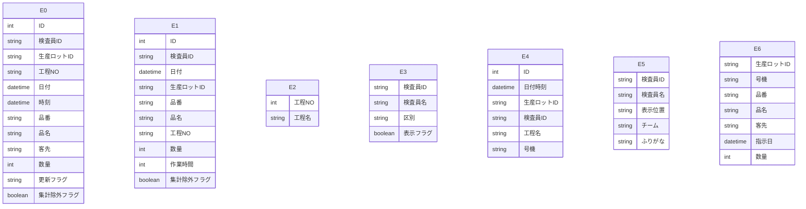

# Access データベース・スキーマ抽出レポート

このファイルは **Access の ODBC メタデータ**から自動生成しました。
LLM に渡す場合は **「スキーマ JSON」セクション**と **「PostgreSQL DDL 草案」**をあわせて指示に含めると、目的の RDB に近い定義を再現しやすくなります。

## LLM / AI 向け: このドキュメントの使い方

以下をプロンプトにコピーして、目的の SQL ダイアレクト（例: PostgreSQL）向け **CREATE TABLE・INDEX・FK** を生成させてください。

```text
あなたはデータベース設計者です。添付 Markdown の次を根拠に、一貫したリレーショナルスキーマを設計してください。
1) YAML フロントマターと「サマリー」の数値
2) 「スキーマ JSON（機械可読・全量）」の tables / relationships / warnings
3) 「PostgreSQL DDL 草案」は参考用。型・NULL・FK・インデックスを JSON・列定義と突き合わせて修正すること。
4) ODBC が SYNONYM としたテーブルはリンク元の実体が別にある場合がある。移行時はデータ取得元を明示すること。
5) relationships が空のときは、列名・サンプルデータから FK を推論してよいが、推論はコメントで区別すること。
出力: (a) 最終 DDL (b) 設計上の想定・未確定事項の箇条書き
```

> ⚠ FK 取得スキップ: t_外観検査記録 — ('IM001', '[IM001] [Microsoft][ODBC Driver Manager] ドライバーはこの関数をサポートしていません。 (0) (SQLForeignKeys)')
> ⚠ FK 取得スキップ: t_外観検査集計 — ('IM001', '[IM001] [Microsoft][ODBC Driver Manager] ドライバーはこの関数をサポートしていません。 (0) (SQLForeignKeys)')
> ⚠ FK 取得スキップ: t_工程マスタ — ('IM001', '[IM001] [Microsoft][ODBC Driver Manager] ドライバーはこの関数をサポートしていません。 (0) (SQLForeignKeys)')
> ⚠ FK 取得スキップ: t_数値検査員マスタ — ('IM001', '[IM001] [Microsoft][ODBC Driver Manager] ドライバーはこの関数をサポートしていません。 (0) (SQLForeignKeys)')
> ⚠ FK 取得スキップ: t_数値検査記録 — ('IM001', '[IM001] [Microsoft][ODBC Driver Manager] ドライバーはこの関数をサポートしていません。 (0) (SQLForeignKeys)')
> ⚠ FK 取得スキップ: t_検査員マスタ — ('IM001', '[IM001] [Microsoft][ODBC Driver Manager] ドライバーはこの関数をサポートしていません。 (0) (SQLForeignKeys)')
> ⚠ FK 取得スキップ: t_現品票検索用 — ('IM001', '[IM001] [Microsoft][ODBC Driver Manager] ドライバーはこの関数をサポートしていません。 (0) (SQLForeignKeys)')

## サマリー

| 項目 | 値 |
|---|---|
| Access ファイル | `\\192.168.1.200\共有\品質保証課\外観検査記録\外観検査記録照会.accdb` |
| ODBC ドライバ | `Microsoft Access Driver (*.mdb, *.accdb)` |
| テーブル数 | 7 |
| 行数合計（取得できたテーブルのみ） | 296,924 |
| リンクテーブル相当（ODBC: SYNONYM） | 7 |
| 外部キー（検出分） | 0 |
| ビュー / クエリ名 | 2 |
| 警告 | 7 |

## ER 図（Mermaid・参考）

Mermaid 内のエンティティは `E0`, `E1`, … です。実テーブル名は次の対応表を参照してください。

| 記号 | テーブル名 | ODBC 型 | 行数 |
|---|---|---:|---:|
| E0 | `t_外観検査記録` | SYNONYM | 61,423 |
| E1 | `t_外観検査集計` | SYNONYM | 45,662 |
| E2 | `t_工程マスタ` | SYNONYM | 10 |
| E3 | `t_数値検査員マスタ` | SYNONYM | 14 |
| E4 | `t_数値検査記録` | SYNONYM | 22,945 |
| E5 | `t_検査員マスタ` | SYNONYM | 76 |
| E6 | `t_現品票検索用` | SYNONYM | 166,794 |



## PostgreSQL DDL 草案（全文・自動生成）

```sql
-- PostgreSQL DDL 草案（Access メタデータから自動生成）
-- ※ 型・制約は必ず手動で確認・修正してください

CREATE TABLE "t_外観検査記録" (
    "ID" BIGSERIAL,
    "検査員ID" VARCHAR(4),
    "生産ロットID" VARCHAR(7),
    "工程NO" VARCHAR(2),
    "日付" TIMESTAMP,
    "時刻" TIMESTAMP,
    "品番" VARCHAR(30),
    "品名" VARCHAR(30),
    "客先" VARCHAR(25),
    "数量" INTEGER,
    "更新フラグ" VARCHAR(1),
    "集計除外フラグ" BOOLEAN NOT NULL
);


CREATE TABLE "t_外観検査集計" (
    "ID" BIGSERIAL,
    "検査員ID" VARCHAR(4),
    "日付" TIMESTAMP,
    "生産ロットID" VARCHAR(7),
    "品番" VARCHAR(30),
    "品名" VARCHAR(30),
    "工程NO" VARCHAR(2),
    "数量" INTEGER,
    "作業時間" INTEGER,
    "集計除外フラグ" BOOLEAN NOT NULL
);


CREATE TABLE "t_工程マスタ" (
    "工程NO" INTEGER,
    "工程名" VARCHAR(10)
);


CREATE TABLE "t_数値検査員マスタ" (
    "検査員ID" VARCHAR(4),
    "検査員名" VARCHAR(5),
    "区別" VARCHAR(5),
    "表示フラグ" BOOLEAN NOT NULL
);


CREATE TABLE "t_数値検査記録" (
    "ID" BIGSERIAL,
    "日付時刻" TIMESTAMP,
    "生産ロットID" VARCHAR(7),
    "検査員ID" VARCHAR(4),
    "工程名" VARCHAR(30),
    "号機" VARCHAR(5)
);


CREATE TABLE "t_検査員マスタ" (
    "検査員ID" VARCHAR(4),
    "検査員名" VARCHAR(10),
    "表示位置" VARCHAR(3),
    "チーム" VARCHAR(1),
    "ふりがな" VARCHAR(1)
);


CREATE TABLE "t_現品票検索用" (
    "生産ロットID" VARCHAR(7),
    "号機" VARCHAR(5),
    "品番" VARCHAR(30),
    "品名" VARCHAR(30),
    "客先" VARCHAR(30),
    "指示日" TIMESTAMP,
    "数量" INTEGER
);
```

## スキーマ JSON（機械可読・全量）

以下をパースすれば、テーブル・列・PK・インデックス・サンプル・統計・FK・ビュー名を一括で渡せます。

```json
{
  "export_spec": "access-inspector/schema-export/v1",
  "generated_at": "2026-04-14T07:54:16.085065+00:00",
  "source": {
    "database_path": "\\\\192.168.1.200\\共有\\品質保証課\\外観検査記録\\外観検査記録照会.accdb",
    "driver_used": "Microsoft Access Driver (*.mdb, *.accdb)"
  },
  "summary": {
    "table_count": 7,
    "sum_row_count_where_known": 296924,
    "tables_with_row_count": 7,
    "linked_table_odbc_synonym_count": 7,
    "relationship_count": 0,
    "view_count": 2,
    "warning_count": 7
  },
  "notes_for_consumer": [
    "ODBC の table_type が SYNONYM のテーブルは Access のリンクテーブルであることが多い。",
    "PostgreSQL 型ヒントは参考。最終 DDL は業務要件とデータ実態で確認すること。",
    "relationships が空でも、命名規則やサンプル行から推定された FK があり得る。"
  ],
  "tables": [
    {
      "name": "t_外観検査記録",
      "table_type": "SYNONYM",
      "row_count": 61423,
      "row_count_error": null,
      "primary_key": [],
      "columns": [
        {
          "name": "ID",
          "access_type": "COUNTER",
          "sql_data_type": 4,
          "column_size": 10,
          "decimal_digits": 0,
          "nullable": false,
          "postgres_type_hint": "BIGSERIAL"
        },
        {
          "name": "検査員ID",
          "access_type": "VARCHAR",
          "sql_data_type": -9,
          "column_size": 4,
          "decimal_digits": null,
          "nullable": true,
          "postgres_type_hint": "VARCHAR(4)"
        },
        {
          "name": "生産ロットID",
          "access_type": "VARCHAR",
          "sql_data_type": -9,
          "column_size": 7,
          "decimal_digits": null,
          "nullable": true,
          "postgres_type_hint": "VARCHAR(7)"
        },
        {
          "name": "工程NO",
          "access_type": "VARCHAR",
          "sql_data_type": -9,
          "column_size": 2,
          "decimal_digits": null,
          "nullable": true,
          "postgres_type_hint": "VARCHAR(2)"
        },
        {
          "name": "日付",
          "access_type": "DATETIME",
          "sql_data_type": 9,
          "column_size": 19,
          "decimal_digits": 0,
          "nullable": true,
          "postgres_type_hint": "TIMESTAMP"
        },
        {
          "name": "時刻",
          "access_type": "DATETIME",
          "sql_data_type": 9,
          "column_size": 19,
          "decimal_digits": 0,
          "nullable": true,
          "postgres_type_hint": "TIMESTAMP"
        },
        {
          "name": "品番",
          "access_type": "VARCHAR",
          "sql_data_type": -9,
          "column_size": 30,
          "decimal_digits": null,
          "nullable": true,
          "postgres_type_hint": "VARCHAR(30)"
        },
        {
          "name": "品名",
          "access_type": "VARCHAR",
          "sql_data_type": -9,
          "column_size": 30,
          "decimal_digits": null,
          "nullable": true,
          "postgres_type_hint": "VARCHAR(30)"
        },
        {
          "name": "客先",
          "access_type": "VARCHAR",
          "sql_data_type": -9,
          "column_size": 25,
          "decimal_digits": null,
          "nullable": true,
          "postgres_type_hint": "VARCHAR(25)"
        },
        {
          "name": "数量",
          "access_type": "INTEGER",
          "sql_data_type": 4,
          "column_size": 10,
          "decimal_digits": 0,
          "nullable": true,
          "postgres_type_hint": "INTEGER"
        },
        {
          "name": "更新フラグ",
          "access_type": "VARCHAR",
          "sql_data_type": -9,
          "column_size": 1,
          "decimal_digits": null,
          "nullable": true,
          "postgres_type_hint": "VARCHAR(1)"
        },
        {
          "name": "集計除外フラグ",
          "access_type": "BIT",
          "sql_data_type": -7,
          "column_size": 1,
          "decimal_digits": 0,
          "nullable": false,
          "postgres_type_hint": "BOOLEAN"
        }
      ],
      "indexes": [],
      "sample_headers": [
        "ID",
        "検査員ID",
        "生産ロットID",
        "工程NO",
        "日付",
        "時刻",
        "品番",
        "品名",
        "客先",
        "数量",
        "更新フラグ",
        "集計除外フラグ"
      ],
      "sample_rows": [
        [
          225708,
          "V020",
          "P129606",
          "4",
          "2025-01-06T00:00:00",
          "1899-12-30T07:55:00",
          "08131-01010",
          "ﾄﾞﾗｲﾊﾞ",
          "不二工機",
          3083,
          null,
          false
        ],
        [
          225709,
          "V053",
          "P129605",
          "4",
          "2025-01-06T00:00:00",
          "1899-12-30T07:59:00",
          "08131-01010",
          "ﾄﾞﾗｲﾊﾞ",
          "不二工機",
          3216,
          null,
          false
        ],
        [
          225710,
          "V065",
          "P129390",
          "4",
          "2025-01-06T00:00:00",
          "1899-12-30T07:59:00",
          "99759-00022",
          "シャフトB",
          "三協",
          4886,
          null,
          false
        ],
        [
          225712,
          "V011",
          "E014893",
          "3",
          "2025-01-06T00:00:00",
          "1899-12-30T08:03:00",
          "3W4PR3289",
          "ｲﾝｻｰﾄﾌﾞｯｼｭ",
          "クラウン精密",
          2502,
          null,
          false
        ],
        [
          225713,
          "V004",
          "E014894",
          "3",
          "2025-01-06T00:00:00",
          "1899-12-30T08:03:00",
          "3W4PR3289",
          "ｲﾝｻｰﾄﾌﾞｯｼｭ",
          "クラウン精密",
          2500,
          null,
          false
        ]
      ],
      "column_stats": []
    },
    {
      "name": "t_外観検査集計",
      "table_type": "SYNONYM",
      "row_count": 45662,
      "row_count_error": null,
      "primary_key": [],
      "columns": [
        {
          "name": "ID",
          "access_type": "COUNTER",
          "sql_data_type": 4,
          "column_size": 10,
          "decimal_digits": 0,
          "nullable": false,
          "postgres_type_hint": "BIGSERIAL"
        },
        {
          "name": "検査員ID",
          "access_type": "VARCHAR",
          "sql_data_type": -9,
          "column_size": 4,
          "decimal_digits": null,
          "nullable": true,
          "postgres_type_hint": "VARCHAR(4)"
        },
        {
          "name": "日付",
          "access_type": "DATETIME",
          "sql_data_type": 9,
          "column_size": 19,
          "decimal_digits": 0,
          "nullable": true,
          "postgres_type_hint": "TIMESTAMP"
        },
        {
          "name": "生産ロットID",
          "access_type": "VARCHAR",
          "sql_data_type": -9,
          "column_size": 7,
          "decimal_digits": null,
          "nullable": true,
          "postgres_type_hint": "VARCHAR(7)"
        },
        {
          "name": "品番",
          "access_type": "VARCHAR",
          "sql_data_type": -9,
          "column_size": 30,
          "decimal_digits": null,
          "nullable": true,
          "postgres_type_hint": "VARCHAR(30)"
        },
        {
          "name": "品名",
          "access_type": "VARCHAR",
          "sql_data_type": -9,
          "column_size": 30,
          "decimal_digits": null,
          "nullable": true,
          "postgres_type_hint": "VARCHAR(30)"
        },
        {
          "name": "工程NO",
          "access_type": "VARCHAR",
          "sql_data_type": -9,
          "column_size": 2,
          "decimal_digits": null,
          "nullable": true,
          "postgres_type_hint": "VARCHAR(2)"
        },
        {
          "name": "数量",
          "access_type": "INTEGER",
          "sql_data_type": 4,
          "column_size": 10,
          "decimal_digits": 0,
          "nullable": true,
          "postgres_type_hint": "INTEGER"
        },
        {
          "name": "作業時間",
          "access_type": "INTEGER",
          "sql_data_type": 4,
          "column_size": 10,
          "decimal_digits": 0,
          "nullable": true,
          "postgres_type_hint": "INTEGER"
        },
        {
          "name": "集計除外フラグ",
          "access_type": "BIT",
          "sql_data_type": -7,
          "column_size": 1,
          "decimal_digits": 0,
          "nullable": false,
          "postgres_type_hint": "BOOLEAN"
        }
      ],
      "indexes": [],
      "sample_headers": [
        "ID",
        "検査員ID",
        "日付",
        "生産ロットID",
        "品番",
        "品名",
        "工程NO",
        "数量",
        "作業時間",
        "集計除外フラグ"
      ],
      "sample_rows": [
        [
          177965,
          "V053",
          "2025-01-06T00:00:00",
          "P129605",
          "08131-01010",
          "ﾄﾞﾗｲﾊﾞ",
          "4",
          3216,
          6,
          false
        ],
        [
          177966,
          "V039",
          "2025-01-06T00:00:00",
          "P129719",
          "08131-01010",
          "ﾄﾞﾗｲﾊﾞ",
          "4",
          3208,
          66,
          false
        ],
        [
          177967,
          "V053",
          "2025-01-06T00:00:00",
          "P129621",
          "08131-01010",
          "ﾄﾞﾗｲﾊﾞ",
          "4",
          3468,
          87,
          false
        ],
        [
          177968,
          "V020",
          "2025-01-06T00:00:00",
          "P129606",
          "08131-01010",
          "ﾄﾞﾗｲﾊﾞ",
          "4",
          3083,
          105,
          false
        ],
        [
          177969,
          "V063",
          "2025-01-06T00:00:00",
          "P129504",
          "99759-00022",
          "シャフトB",
          "4",
          3783,
          80,
          false
        ]
      ],
      "column_stats": []
    },
    {
      "name": "t_工程マスタ",
      "table_type": "SYNONYM",
      "row_count": 10,
      "row_count_error": null,
      "primary_key": [],
      "columns": [
        {
          "name": "工程NO",
          "access_type": "INTEGER",
          "sql_data_type": 4,
          "column_size": 10,
          "decimal_digits": 0,
          "nullable": true,
          "postgres_type_hint": "INTEGER"
        },
        {
          "name": "工程名",
          "access_type": "VARCHAR",
          "sql_data_type": -9,
          "column_size": 10,
          "decimal_digits": null,
          "nullable": true,
          "postgres_type_hint": "VARCHAR(10)"
        }
      ],
      "indexes": [],
      "sample_headers": [
        "工程NO",
        "工程名"
      ],
      "sample_rows": [
        [
          15,
          "バリ取り"
        ],
        [
          16,
          "ゲージ検査"
        ],
        [
          17,
          "エアー吹き"
        ],
        [
          18,
          "切粉除去"
        ],
        [
          19,
          "返品再検査"
        ]
      ],
      "column_stats": []
    },
    {
      "name": "t_数値検査員マスタ",
      "table_type": "SYNONYM",
      "row_count": 14,
      "row_count_error": null,
      "primary_key": [],
      "columns": [
        {
          "name": "検査員ID",
          "access_type": "VARCHAR",
          "sql_data_type": -9,
          "column_size": 4,
          "decimal_digits": null,
          "nullable": true,
          "postgres_type_hint": "VARCHAR(4)"
        },
        {
          "name": "検査員名",
          "access_type": "VARCHAR",
          "sql_data_type": -9,
          "column_size": 5,
          "decimal_digits": null,
          "nullable": true,
          "postgres_type_hint": "VARCHAR(5)"
        },
        {
          "name": "区別",
          "access_type": "VARCHAR",
          "sql_data_type": -9,
          "column_size": 5,
          "decimal_digits": null,
          "nullable": true,
          "postgres_type_hint": "VARCHAR(5)"
        },
        {
          "name": "表示フラグ",
          "access_type": "BIT",
          "sql_data_type": -7,
          "column_size": 1,
          "decimal_digits": 0,
          "nullable": false,
          "postgres_type_hint": "BOOLEAN"
        }
      ],
      "indexes": [],
      "sample_headers": [
        "検査員ID",
        "検査員名",
        "区別",
        "表示フラグ"
      ],
      "sample_rows": [
        [
          "0",
          "旧０",
          null,
          false
        ],
        [
          "1",
          "旧１",
          null,
          false
        ],
        [
          "11",
          "千葉かおる",
          "担当",
          true
        ],
        [
          "12",
          "山中かおり",
          "担当",
          true
        ],
        [
          "13",
          "新井春香",
          "担当",
          true
        ]
      ],
      "column_stats": []
    },
    {
      "name": "t_数値検査記録",
      "table_type": "SYNONYM",
      "row_count": 22945,
      "row_count_error": null,
      "primary_key": [],
      "columns": [
        {
          "name": "ID",
          "access_type": "COUNTER",
          "sql_data_type": 4,
          "column_size": 10,
          "decimal_digits": 0,
          "nullable": false,
          "postgres_type_hint": "BIGSERIAL"
        },
        {
          "name": "日付時刻",
          "access_type": "DATETIME",
          "sql_data_type": 9,
          "column_size": 19,
          "decimal_digits": 0,
          "nullable": true,
          "postgres_type_hint": "TIMESTAMP"
        },
        {
          "name": "生産ロットID",
          "access_type": "VARCHAR",
          "sql_data_type": -9,
          "column_size": 7,
          "decimal_digits": null,
          "nullable": true,
          "postgres_type_hint": "VARCHAR(7)"
        },
        {
          "name": "検査員ID",
          "access_type": "VARCHAR",
          "sql_data_type": -9,
          "column_size": 4,
          "decimal_digits": null,
          "nullable": true,
          "postgres_type_hint": "VARCHAR(4)"
        },
        {
          "name": "工程名",
          "access_type": "VARCHAR",
          "sql_data_type": -9,
          "column_size": 30,
          "decimal_digits": null,
          "nullable": true,
          "postgres_type_hint": "VARCHAR(30)"
        },
        {
          "name": "号機",
          "access_type": "VARCHAR",
          "sql_data_type": -9,
          "column_size": 5,
          "decimal_digits": null,
          "nullable": true,
          "postgres_type_hint": "VARCHAR(5)"
        }
      ],
      "indexes": [],
      "sample_headers": [
        "ID",
        "日付時刻",
        "生産ロットID",
        "検査員ID",
        "工程名",
        "号機"
      ],
      "sample_rows": [
        [
          117,
          "2024-10-10T10:47:28",
          "P126569",
          "16",
          "数値検査",
          "F-6"
        ],
        [
          118,
          "2024-10-10T10:47:44",
          "P126610",
          "16",
          "数値検査",
          "F-6"
        ],
        [
          119,
          "2024-10-10T10:48:01",
          "P126654",
          "16",
          "数値検査",
          "F-6"
        ],
        [
          120,
          "2024-10-10T10:48:16",
          "P126697",
          "16",
          "数値検査",
          "F-6"
        ],
        [
          121,
          "2024-10-10T10:48:34",
          "P126444",
          "16",
          "数値検査",
          "F-6"
        ]
      ],
      "column_stats": []
    },
    {
      "name": "t_検査員マスタ",
      "table_type": "SYNONYM",
      "row_count": 76,
      "row_count_error": null,
      "primary_key": [],
      "columns": [
        {
          "name": "検査員ID",
          "access_type": "VARCHAR",
          "sql_data_type": -9,
          "column_size": 4,
          "decimal_digits": null,
          "nullable": true,
          "postgres_type_hint": "VARCHAR(4)"
        },
        {
          "name": "検査員名",
          "access_type": "VARCHAR",
          "sql_data_type": -9,
          "column_size": 10,
          "decimal_digits": null,
          "nullable": true,
          "postgres_type_hint": "VARCHAR(10)"
        },
        {
          "name": "表示位置",
          "access_type": "VARCHAR",
          "sql_data_type": -9,
          "column_size": 3,
          "decimal_digits": null,
          "nullable": true,
          "postgres_type_hint": "VARCHAR(3)"
        },
        {
          "name": "チーム",
          "access_type": "VARCHAR",
          "sql_data_type": -9,
          "column_size": 1,
          "decimal_digits": null,
          "nullable": true,
          "postgres_type_hint": "VARCHAR(1)"
        },
        {
          "name": "ふりがな",
          "access_type": "VARCHAR",
          "sql_data_type": -9,
          "column_size": 1,
          "decimal_digits": null,
          "nullable": true,
          "postgres_type_hint": "VARCHAR(1)"
        }
      ],
      "indexes": [],
      "sample_headers": [
        "検査員ID",
        "検査員名",
        "表示位置",
        "チーム",
        "ふりがな"
      ],
      "sample_rows": [
        [
          "V001",
          "中",
          null,
          null,
          "な"
        ],
        [
          "V002",
          "鈴木",
          "210",
          "A",
          "す"
        ],
        [
          "V003",
          "吉岡",
          null,
          null,
          "よ"
        ],
        [
          "V004",
          "新井(登)",
          "28",
          "A",
          "あ"
        ],
        [
          "V005",
          "前森",
          "211",
          "A",
          "ま"
        ]
      ],
      "column_stats": []
    },
    {
      "name": "t_現品票検索用",
      "table_type": "SYNONYM",
      "row_count": 166794,
      "row_count_error": null,
      "primary_key": [],
      "columns": [
        {
          "name": "生産ロットID",
          "access_type": "VARCHAR",
          "sql_data_type": -9,
          "column_size": 7,
          "decimal_digits": null,
          "nullable": true,
          "postgres_type_hint": "VARCHAR(7)"
        },
        {
          "name": "号機",
          "access_type": "VARCHAR",
          "sql_data_type": -9,
          "column_size": 5,
          "decimal_digits": null,
          "nullable": true,
          "postgres_type_hint": "VARCHAR(5)"
        },
        {
          "name": "品番",
          "access_type": "VARCHAR",
          "sql_data_type": -9,
          "column_size": 30,
          "decimal_digits": null,
          "nullable": true,
          "postgres_type_hint": "VARCHAR(30)"
        },
        {
          "name": "品名",
          "access_type": "VARCHAR",
          "sql_data_type": -9,
          "column_size": 30,
          "decimal_digits": null,
          "nullable": true,
          "postgres_type_hint": "VARCHAR(30)"
        },
        {
          "name": "客先",
          "access_type": "VARCHAR",
          "sql_data_type": -9,
          "column_size": 30,
          "decimal_digits": null,
          "nullable": true,
          "postgres_type_hint": "VARCHAR(30)"
        },
        {
          "name": "指示日",
          "access_type": "DATETIME",
          "sql_data_type": 9,
          "column_size": 19,
          "decimal_digits": 0,
          "nullable": true,
          "postgres_type_hint": "TIMESTAMP"
        },
        {
          "name": "数量",
          "access_type": "INTEGER",
          "sql_data_type": 4,
          "column_size": 10,
          "decimal_digits": 0,
          "nullable": true,
          "postgres_type_hint": "INTEGER"
        }
      ],
      "indexes": [],
      "sample_headers": [
        "生産ロットID",
        "号機",
        "品番",
        "品名",
        "客先",
        "指示日",
        "数量"
      ],
      "sample_rows": [
        [
          "E000001",
          "AN",
          "00575532-01",
          "カラー 8×8.16",
          "東京鋲兼",
          "2017-10-12T00:00:00",
          3730
        ],
        [
          "E000002",
          "AN",
          "00575532-01",
          "カラー 8×8.16",
          "東京鋲兼",
          "2017-10-14T00:00:00",
          1370
        ],
        [
          "E000003",
          "AN",
          "00575532-05",
          "カラー 8×8.14",
          "東京鋲兼",
          "2017-10-14T00:00:00",
          2700
        ],
        [
          "E000004",
          "AN-1",
          "FA用リベット",
          "FA用リベット",
          "イワタボルト",
          "2017-10-14T00:00:00",
          10000
        ],
        [
          "E000005",
          "AN-2",
          "FA用リベット",
          "FA用リベット",
          "イワタボルト",
          "2017-10-14T00:00:00",
          10000
        ]
      ],
      "column_stats": []
    }
  ],
  "relationships": [],
  "views_and_queries": [
    {
      "name": "Q_生産ロットまとめ",
      "type": "VIEW"
    },
    {
      "name": "Q_生産ロット集計",
      "type": "VIEW"
    }
  ],
  "warnings": [
    "FK 取得スキップ: t_外観検査記録 — ('IM001', '[IM001] [Microsoft][ODBC Driver Manager] ドライバーはこの関数をサポートしていません。 (0) (SQLForeignKeys)')",
    "FK 取得スキップ: t_外観検査集計 — ('IM001', '[IM001] [Microsoft][ODBC Driver Manager] ドライバーはこの関数をサポートしていません。 (0) (SQLForeignKeys)')",
    "FK 取得スキップ: t_工程マスタ — ('IM001', '[IM001] [Microsoft][ODBC Driver Manager] ドライバーはこの関数をサポートしていません。 (0) (SQLForeignKeys)')",
    "FK 取得スキップ: t_数値検査員マスタ — ('IM001', '[IM001] [Microsoft][ODBC Driver Manager] ドライバーはこの関数をサポートしていません。 (0) (SQLForeignKeys)')",
    "FK 取得スキップ: t_数値検査記録 — ('IM001', '[IM001] [Microsoft][ODBC Driver Manager] ドライバーはこの関数をサポートしていません。 (0) (SQLForeignKeys)')",
    "FK 取得スキップ: t_検査員マスタ — ('IM001', '[IM001] [Microsoft][ODBC Driver Manager] ドライバーはこの関数をサポートしていません。 (0) (SQLForeignKeys)')",
    "FK 取得スキップ: t_現品票検索用 — ('IM001', '[IM001] [Microsoft][ODBC Driver Manager] ドライバーはこの関数をサポートしていません。 (0) (SQLForeignKeys)')"
  ]
}
```

## テーブル一覧

| テーブル | ODBC 型 | 行数 | PK | インデックス数 |
|---|---|---:|---|---:|
| `t_外観検査記録` | SYNONYM | 61,423 | — | 0 |
| `t_外観検査集計` | SYNONYM | 45,662 | — | 0 |
| `t_工程マスタ` | SYNONYM | 10 | — | 0 |
| `t_数値検査員マスタ` | SYNONYM | 14 | — | 0 |
| `t_数値検査記録` | SYNONYM | 22,945 | — | 0 |
| `t_検査員マスタ` | SYNONYM | 76 | — | 0 |
| `t_現品票検索用` | SYNONYM | 166,794 | — | 0 |

## カラム詳細

### `t_外観検査記録`

- **ODBC テーブル種別**: SYNONYM
- **行数**: 61,423

| 列 | Access 型 | PG 型ヒント | sql_data_type | サイズ | 小数 | NULL | PK |
|---|---|---|---:|---:|---:|:---:|:---:|
| ID | COUNTER | BIGSERIAL | 4 | 10 | 0 | × |  |
| 検査員ID | VARCHAR | VARCHAR(4) | -9 | 4 |  | ○ |  |
| 生産ロットID | VARCHAR | VARCHAR(7) | -9 | 7 |  | ○ |  |
| 工程NO | VARCHAR | VARCHAR(2) | -9 | 2 |  | ○ |  |
| 日付 | DATETIME | TIMESTAMP | 9 | 19 | 0 | ○ |  |
| 時刻 | DATETIME | TIMESTAMP | 9 | 19 | 0 | ○ |  |
| 品番 | VARCHAR | VARCHAR(30) | -9 | 30 |  | ○ |  |
| 品名 | VARCHAR | VARCHAR(30) | -9 | 30 |  | ○ |  |
| 客先 | VARCHAR | VARCHAR(25) | -9 | 25 |  | ○ |  |
| 数量 | INTEGER | INTEGER | 4 | 10 | 0 | ○ |  |
| 更新フラグ | VARCHAR | VARCHAR(1) | -9 | 1 |  | ○ |  |
| 集計除外フラグ | BIT | BOOLEAN | -7 | 1 | 0 | × |  |

**サンプルデータ（先頭数行）**

| ID | 検査員ID | 生産ロットID | 工程NO | 日付 | 時刻 | 品番 | 品名 | 客先 | 数量 | 更新フラグ | 集計除外フラグ |
|---|---|---|---|---|---|---|---|---|---|---|---|
| 225708 | V020 | P129606 | 4 | 2025-01-06T00:00:00 | 1899-12-30T07:55:00 | 08131-01010 | ﾄﾞﾗｲﾊﾞ | 不二工機 | 3083 | NULL | False |
| 225709 | V053 | P129605 | 4 | 2025-01-06T00:00:00 | 1899-12-30T07:59:00 | 08131-01010 | ﾄﾞﾗｲﾊﾞ | 不二工機 | 3216 | NULL | False |
| 225710 | V065 | P129390 | 4 | 2025-01-06T00:00:00 | 1899-12-30T07:59:00 | 99759-00022 | シャフトB | 三協 | 4886 | NULL | False |
| 225712 | V011 | E014893 | 3 | 2025-01-06T00:00:00 | 1899-12-30T08:03:00 | 3W4PR3289 | ｲﾝｻｰﾄﾌﾞｯｼｭ | クラウン精密 | 2502 | NULL | False |
| 225713 | V004 | E014894 | 3 | 2025-01-06T00:00:00 | 1899-12-30T08:03:00 | 3W4PR3289 | ｲﾝｻｰﾄﾌﾞｯｼｭ | クラウン精密 | 2500 | NULL | False |

### `t_外観検査集計`

- **ODBC テーブル種別**: SYNONYM
- **行数**: 45,662

| 列 | Access 型 | PG 型ヒント | sql_data_type | サイズ | 小数 | NULL | PK |
|---|---|---|---:|---:|---:|:---:|:---:|
| ID | COUNTER | BIGSERIAL | 4 | 10 | 0 | × |  |
| 検査員ID | VARCHAR | VARCHAR(4) | -9 | 4 |  | ○ |  |
| 日付 | DATETIME | TIMESTAMP | 9 | 19 | 0 | ○ |  |
| 生産ロットID | VARCHAR | VARCHAR(7) | -9 | 7 |  | ○ |  |
| 品番 | VARCHAR | VARCHAR(30) | -9 | 30 |  | ○ |  |
| 品名 | VARCHAR | VARCHAR(30) | -9 | 30 |  | ○ |  |
| 工程NO | VARCHAR | VARCHAR(2) | -9 | 2 |  | ○ |  |
| 数量 | INTEGER | INTEGER | 4 | 10 | 0 | ○ |  |
| 作業時間 | INTEGER | INTEGER | 4 | 10 | 0 | ○ |  |
| 集計除外フラグ | BIT | BOOLEAN | -7 | 1 | 0 | × |  |

**サンプルデータ（先頭数行）**

| ID | 検査員ID | 日付 | 生産ロットID | 品番 | 品名 | 工程NO | 数量 | 作業時間 | 集計除外フラグ |
|---|---|---|---|---|---|---|---|---|---|
| 177965 | V053 | 2025-01-06T00:00:00 | P129605 | 08131-01010 | ﾄﾞﾗｲﾊﾞ | 4 | 3216 | 6 | False |
| 177966 | V039 | 2025-01-06T00:00:00 | P129719 | 08131-01010 | ﾄﾞﾗｲﾊﾞ | 4 | 3208 | 66 | False |
| 177967 | V053 | 2025-01-06T00:00:00 | P129621 | 08131-01010 | ﾄﾞﾗｲﾊﾞ | 4 | 3468 | 87 | False |
| 177968 | V020 | 2025-01-06T00:00:00 | P129606 | 08131-01010 | ﾄﾞﾗｲﾊﾞ | 4 | 3083 | 105 | False |
| 177969 | V063 | 2025-01-06T00:00:00 | P129504 | 99759-00022 | シャフトB | 4 | 3783 | 80 | False |

### `t_工程マスタ`

- **ODBC テーブル種別**: SYNONYM
- **行数**: 10

| 列 | Access 型 | PG 型ヒント | sql_data_type | サイズ | 小数 | NULL | PK |
|---|---|---|---:|---:|---:|:---:|:---:|
| 工程NO | INTEGER | INTEGER | 4 | 10 | 0 | ○ |  |
| 工程名 | VARCHAR | VARCHAR(10) | -9 | 10 |  | ○ |  |

**サンプルデータ（先頭数行）**

| 工程NO | 工程名 |
|---|---|
| 15 | バリ取り |
| 16 | ゲージ検査 |
| 17 | エアー吹き |
| 18 | 切粉除去 |
| 19 | 返品再検査 |

### `t_数値検査員マスタ`

- **ODBC テーブル種別**: SYNONYM
- **行数**: 14

| 列 | Access 型 | PG 型ヒント | sql_data_type | サイズ | 小数 | NULL | PK |
|---|---|---|---:|---:|---:|:---:|:---:|
| 検査員ID | VARCHAR | VARCHAR(4) | -9 | 4 |  | ○ |  |
| 検査員名 | VARCHAR | VARCHAR(5) | -9 | 5 |  | ○ |  |
| 区別 | VARCHAR | VARCHAR(5) | -9 | 5 |  | ○ |  |
| 表示フラグ | BIT | BOOLEAN | -7 | 1 | 0 | × |  |

**サンプルデータ（先頭数行）**

| 検査員ID | 検査員名 | 区別 | 表示フラグ |
|---|---|---|---|
| 0 | 旧０ | NULL | False |
| 1 | 旧１ | NULL | False |
| 11 | 千葉かおる | 担当 | True |
| 12 | 山中かおり | 担当 | True |
| 13 | 新井春香 | 担当 | True |

### `t_数値検査記録`

- **ODBC テーブル種別**: SYNONYM
- **行数**: 22,945

| 列 | Access 型 | PG 型ヒント | sql_data_type | サイズ | 小数 | NULL | PK |
|---|---|---|---:|---:|---:|:---:|:---:|
| ID | COUNTER | BIGSERIAL | 4 | 10 | 0 | × |  |
| 日付時刻 | DATETIME | TIMESTAMP | 9 | 19 | 0 | ○ |  |
| 生産ロットID | VARCHAR | VARCHAR(7) | -9 | 7 |  | ○ |  |
| 検査員ID | VARCHAR | VARCHAR(4) | -9 | 4 |  | ○ |  |
| 工程名 | VARCHAR | VARCHAR(30) | -9 | 30 |  | ○ |  |
| 号機 | VARCHAR | VARCHAR(5) | -9 | 5 |  | ○ |  |

**サンプルデータ（先頭数行）**

| ID | 日付時刻 | 生産ロットID | 検査員ID | 工程名 | 号機 |
|---|---|---|---|---|---|
| 117 | 2024-10-10T10:47:28 | P126569 | 16 | 数値検査 | F-6 |
| 118 | 2024-10-10T10:47:44 | P126610 | 16 | 数値検査 | F-6 |
| 119 | 2024-10-10T10:48:01 | P126654 | 16 | 数値検査 | F-6 |
| 120 | 2024-10-10T10:48:16 | P126697 | 16 | 数値検査 | F-6 |
| 121 | 2024-10-10T10:48:34 | P126444 | 16 | 数値検査 | F-6 |

### `t_検査員マスタ`

- **ODBC テーブル種別**: SYNONYM
- **行数**: 76

| 列 | Access 型 | PG 型ヒント | sql_data_type | サイズ | 小数 | NULL | PK |
|---|---|---|---:|---:|---:|:---:|:---:|
| 検査員ID | VARCHAR | VARCHAR(4) | -9 | 4 |  | ○ |  |
| 検査員名 | VARCHAR | VARCHAR(10) | -9 | 10 |  | ○ |  |
| 表示位置 | VARCHAR | VARCHAR(3) | -9 | 3 |  | ○ |  |
| チーム | VARCHAR | VARCHAR(1) | -9 | 1 |  | ○ |  |
| ふりがな | VARCHAR | VARCHAR(1) | -9 | 1 |  | ○ |  |

**サンプルデータ（先頭数行）**

| 検査員ID | 検査員名 | 表示位置 | チーム | ふりがな |
|---|---|---|---|---|
| V001 | 中 | NULL | NULL | な |
| V002 | 鈴木 | 210 | A | す |
| V003 | 吉岡 | NULL | NULL | よ |
| V004 | 新井(登) | 28 | A | あ |
| V005 | 前森 | 211 | A | ま |

### `t_現品票検索用`

- **ODBC テーブル種別**: SYNONYM
- **行数**: 166,794

| 列 | Access 型 | PG 型ヒント | sql_data_type | サイズ | 小数 | NULL | PK |
|---|---|---|---:|---:|---:|:---:|:---:|
| 生産ロットID | VARCHAR | VARCHAR(7) | -9 | 7 |  | ○ |  |
| 号機 | VARCHAR | VARCHAR(5) | -9 | 5 |  | ○ |  |
| 品番 | VARCHAR | VARCHAR(30) | -9 | 30 |  | ○ |  |
| 品名 | VARCHAR | VARCHAR(30) | -9 | 30 |  | ○ |  |
| 客先 | VARCHAR | VARCHAR(30) | -9 | 30 |  | ○ |  |
| 指示日 | DATETIME | TIMESTAMP | 9 | 19 | 0 | ○ |  |
| 数量 | INTEGER | INTEGER | 4 | 10 | 0 | ○ |  |

**サンプルデータ（先頭数行）**

| 生産ロットID | 号機 | 品番 | 品名 | 客先 | 指示日 | 数量 |
|---|---|---|---|---|---|---|
| E000001 | AN | 00575532-01 | カラー 8×8.16 | 東京鋲兼 | 2017-10-12T00:00:00 | 3730 |
| E000002 | AN | 00575532-01 | カラー 8×8.16 | 東京鋲兼 | 2017-10-14T00:00:00 | 1370 |
| E000003 | AN | 00575532-05 | カラー 8×8.14 | 東京鋲兼 | 2017-10-14T00:00:00 | 2700 |
| E000004 | AN-1 | FA用リベット | FA用リベット | イワタボルト | 2017-10-14T00:00:00 | 10000 |
| E000005 | AN-2 | FA用リベット | FA用リベット | イワタボルト | 2017-10-14T00:00:00 | 10000 |

## リレーション（外部キー）

（検出なし、またはドライバが FK メタデータを返しませんでした）

## ビュー / クエリ

- `Q_生産ロットまとめ` （VIEW）
- `Q_生産ロット集計` （VIEW）
