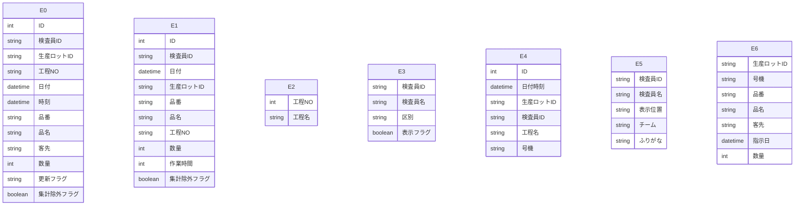

# Access データベース・スキーマ抽出レポート

このファイルは **Access の ODBC メタデータ**から自動生成しました。
LLM に渡す場合は **「スキーマ JSON」セクション**と **「PostgreSQL DDL 草案」**をあわせて指示に含めると、目的の RDB に近い定義を再現しやすくなります。

## LLM / AI 向け: このドキュメントの使い方

以下をプロンプトにコピーして、目的の SQL ダイアレクト（例: PostgreSQL）向け **CREATE TABLE・INDEX・FK** を生成させてください。

```text
あなたはデータベース設計者です。添付 Markdown の次を根拠に、一貫したリレーショナルスキーマを設計してください。
1) YAML フロントマターと「サマリー」の数値
2) 「スキーマ JSON（機械可読・全量）」の tables / relationships / warnings
3) 「PostgreSQL DDL 草案」は参考用。型・NULL・FK・インデックスを JSON・列定義と突き合わせて修正すること。
4) ODBC が SYNONYM としたテーブルはリンク元の実体が別にある場合がある。移行時はデータ取得元を明示すること。
5) relationships が空のときは、列名・サンプルデータから FK を推論してよいが、推論はコメントで区別すること。
出力: (a) 最終 DDL (b) 設計上の想定・未確定事項の箇条書き
```

> ⚠ FK 取得スキップ: t_外観検査記録 — ('IM001', '[IM001] [Microsoft][ODBC Driver Manager] ドライバーはこの関数をサポートしていません。 (0) (SQLForeignKeys)')
> ⚠ FK 取得スキップ: t_外観検査集計 — ('IM001', '[IM001] [Microsoft][ODBC Driver Manager] ドライバーはこの関数をサポートしていません。 (0) (SQLForeignKeys)')
> ⚠ FK 取得スキップ: t_工程マスタ — ('IM001', '[IM001] [Microsoft][ODBC Driver Manager] ドライバーはこの関数をサポートしていません。 (0) (SQLForeignKeys)')
> ⚠ FK 取得スキップ: t_数値検査員マスタ — ('IM001', '[IM001] [Microsoft][ODBC Driver Manager] ドライバーはこの関数をサポートしていません。 (0) (SQLForeignKeys)')
> ⚠ FK 取得スキップ: t_数値検査記録 — ('IM001', '[IM001] [Microsoft][ODBC Driver Manager] ドライバーはこの関数をサポートしていません。 (0) (SQLForeignKeys)')
> ⚠ FK 取得スキップ: t_検査員マスタ — ('IM001', '[IM001] [Microsoft][ODBC Driver Manager] ドライバーはこの関数をサポートしていません。 (0) (SQLForeignKeys)')
> ⚠ FK 取得スキップ: t_現品票検索用 — ('IM001', '[IM001] [Microsoft][ODBC Driver Manager] ドライバーはこの関数をサポートしていません。 (0) (SQLForeignKeys)')

## サマリー

| 項目 | 値 |
|---|---|
| Access ファイル | `\\192.168.1.200\共有\品質保証課\外観検査記録\外観検査記録照会.accdb` |
| ODBC ドライバ | `Microsoft Access Driver (*.mdb, *.accdb)` |
| テーブル数 | 7 |
| 行数合計（取得できたテーブルのみ） | 310,057 |
| リンクテーブル相当（ODBC: SYNONYM） | 7 |
| 外部キー（検出分） | 0 |
| ビュー / クエリ名 | 2 |
| 警告 | 7 |

## ER 図（Mermaid・参考）

Mermaid 内のエンティティは `E0`, `E1`, … です。実テーブル名は次の対応表を参照してください。

| 記号 | テーブル名 | ODBC 型 | 行数 |
|---|---|---:|---:|
| E0 | `t_外観検査記録` | SYNONYM | 66,493 |
| E1 | `t_外観検査集計` | SYNONYM | 49,684 |
| E2 | `t_工程マスタ` | SYNONYM | 10 |
| E3 | `t_数値検査員マスタ` | SYNONYM | 14 |
| E4 | `t_数値検査記録` | SYNONYM | 24,943 |
| E5 | `t_検査員マスタ` | SYNONYM | 76 |
| E6 | `t_現品票検索用` | SYNONYM | 168,837 |


```mermaid
erDiagram
  E0 {
    int ID
    string 検査員ID
    string 生産ロットID
    string 工程NO
    datetime 日付
    datetime 時刻
    string 品番
    string 品名
    string 客先
    int 数量
    string 更新フラグ
    boolean 集計除外フラグ
  }
  E1 {
    int ID
    string 検査員ID
    datetime 日付
    string 生産ロットID
    string 品番
    string 品名
    string 工程NO
    int 数量
    int 作業時間
    boolean 集計除外フラグ
  }
  E2 {
    int 工程NO
    string 工程名
  }
  E3 {
    string 検査員ID
    string 検査員名
    string 区別
    boolean 表示フラグ
  }
  E4 {
    int ID
    datetime 日付時刻
    string 生産ロットID
    string 検査員ID
    string 工程名
    string 号機
  }
  E5 {
    string 検査員ID
    string 検査員名
    string 表示位置
    string チーム
    string ふりがな
  }
  E6 {
    string 生産ロットID
    string 号機
    string 品番
    string 品名
    string 客先
    datetime 指示日
    int 数量
  }
```

## PostgreSQL DDL 草案（全文・自動生成）

```sql
-- PostgreSQL DDL 草案（Access メタデータから自動生成）
-- ※ 型・制約は必ず手動で確認・修正してください

CREATE TABLE "t_外観検査記録" (
    "ID" BIGSERIAL,
    "検査員ID" VARCHAR(4),
    "生産ロットID" VARCHAR(7),
    "工程NO" VARCHAR(2),
    "日付" TIMESTAMP,
    "時刻" TIMESTAMP,
    "品番" VARCHAR(30),
    "品名" VARCHAR(30),
    "客先" VARCHAR(25),
    "数量" INTEGER,
    "更新フラグ" VARCHAR(1),
    "集計除外フラグ" BOOLEAN NOT NULL
);


CREATE TABLE "t_外観検査集計" (
    "ID" BIGSERIAL,
    "検査員ID" VARCHAR(4),
    "日付" TIMESTAMP,
    "生産ロットID" VARCHAR(7),
    "品番" VARCHAR(30),
    "品名" VARCHAR(30),
    "工程NO" VARCHAR(2),
    "数量" INTEGER,
    "作業時間" INTEGER,
    "集計除外フラグ" BOOLEAN NOT NULL
);


CREATE TABLE "t_工程マスタ" (
    "工程NO" INTEGER,
    "工程名" VARCHAR(10)
);


CREATE TABLE "t_数値検査員マスタ" (
    "検査員ID" VARCHAR(4),
    "検査員名" VARCHAR(5),
    "区別" VARCHAR(5),
    "表示フラグ" BOOLEAN NOT NULL
);


CREATE TABLE "t_数値検査記録" (
    "ID" BIGSERIAL,
    "日付時刻" TIMESTAMP,
    "生産ロットID" VARCHAR(7),
    "検査員ID" VARCHAR(4),
    "工程名" VARCHAR(30),
    "号機" VARCHAR(5)
);


CREATE TABLE "t_検査員マスタ" (
    "検査員ID" VARCHAR(4),
    "検査員名" VARCHAR(10),
    "表示位置" VARCHAR(3),
    "チーム" VARCHAR(1),
    "ふりがな" VARCHAR(1)
);


CREATE TABLE "t_現品票検索用" (
    "生産ロットID" VARCHAR(7),
    "号機" VARCHAR(5),
    "品番" VARCHAR(30),
    "品名" VARCHAR(30),
    "客先" VARCHAR(30),
    "指示日" TIMESTAMP,
    "数量" INTEGER
);
```

## スキーマ JSON（機械可読・全量）

以下をパースすれば、テーブル・列・PK・インデックス・サンプル・統計・FK・ビュー名を一括で渡せます。

```json
{
  "export_spec": "access-inspector/schema-export/v1",
  "generated_at": "2026-05-27T04:03:58.825422+00:00",
  "source": {
    "database_path": "\\\\192.168.1.200\\共有\\品質保証課\\外観検査記録\\外観検査記録照会.accdb",
    "driver_used": "Microsoft Access Driver (*.mdb, *.accdb)"
  },
  "summary": {
    "table_count": 7,
    "sum_row_count_where_known": 310057,
    "tables_with_row_count": 7,
    "linked_table_odbc_synonym_count": 7,
    "relationship_count": 0,
    "view_count": 2,
    "warning_count": 7
  },
  "notes_for_consumer": [
    "ODBC の table_type が SYNONYM のテーブルは Access のリンクテーブルであることが多い。",
    "PostgreSQL 型ヒントは参考。最終 DDL は業務要件とデータ実態で確認すること。",
    "relationships が空でも、命名規則やサンプル行から推定された FK があり得る。"
  ],
  "tables": [
    {
      "name": "t_外観検査記録",
      "table_type": "SYNONYM",
      "row_count": 66493,
      "row_count_error": null,
      "primary_key": [],
      "columns": [
        {
          "name": "ID",
          "access_type": "COUNTER",
          "sql_data_type": 4,
          "column_size": 10,
          "decimal_digits": 0,
          "nullable": false,
          "postgres_type_hint": "BIGSERIAL"
        },
        {
          "name": "検査員ID",
          "access_type": "VARCHAR",
          "sql_data_type": -9,
          "column_size": 4,
          "decimal_digits": null,
          "nullable": true,
          "postgres_type_hint": "VARCHAR(4)"
        },
        {
          "name": "生産ロットID",
          "access_type": "VARCHAR",
          "sql_data_type": -9,
          "column_size": 7,
          "decimal_digits": null,
          "nullable": true,
          "postgres_type_hint": "VARCHAR(7)"
        },
        {
          "name": "工程NO",
          "access_type": "VARCHAR",
          "sql_data_type": -9,
          "column_size": 2,
          "decimal_digits": null,
          "nullable": true,
          "postgres_type_hint": "VARCHAR(2)"
        },
        {
          "name": "日付",
          "access_type": "DATETIME",
          "sql_data_type": 9,
          "column_size": 19,
          "decimal_digits": 0,
          "nullable": true,
          "postgres_type_hint": "TIMESTAMP"
        },
        {
          "name": "時刻",
          "access_type": "DATETIME",
          "sql_data_type": 9,
          "column_size": 19,
          "decimal_digits": 0,
          "nullable": true,
          "postgres_type_hint": "TIMESTAMP"
        },
        {
          "name": "品番",
          "access_type": "VARCHAR",
          "sql_data_type": -9,
          "column_size": 30,
          "decimal_digits": null,
          "nullable": true,
          "postgres_type_hint": "VARCHAR(30)"
        },
        {
          "name": "品名",
          "access_type": "VARCHAR",
          "sql_data_type": -9,
          "column_size": 30,
          "decimal_digits": null,
          "nullable": true,
          "postgres_type_hint": "VARCHAR(30)"
        },
        {
          "name": "客先",
          "access_type": "VARCHAR",
          "sql_data_type": -9,
          "column_size": 25,
          "decimal_digits": null,
          "nullable": true,
          "postgres_type_hint": "VARCHAR(25)"
        },
        {
          "name": "数量",
          "access_type": "INTEGER",
          "sql_data_type": 4,
          "column_size": 10,
          "decimal_digits": 0,
          "nullable": true,
          "postgres_type_hint": "INTEGER"
        },
        {
          "name": "更新フラグ",
          "access_type": "VARCHAR",
          "sql_data_type": -9,
          "column_size": 1,
          "decimal_digits": null,
          "nullable": true,
          "postgres_type_hint": "VARCHAR(1)"
        },
        {
          "name": "集計除外フラグ",
          "access_type": "BIT",
          "sql_data_type": -7,
          "column_size": 1,
          "decimal_digits": 0,
          "nullable": false,
          "postgres_type_hint": "BOOLEAN"
        }
      ],
      "indexes": [],
      "sample_headers": [
        "ID",
        "検査員ID",
        "生産ロットID",
        "工程NO",
        "日付",
        "時刻",
        "品番",
        "品名",
        "客先",
        "数量",
        "更新フラグ",
        "集計除外フラグ"
      ],
      "sample_rows": [
        [
          225708,
          "V020",
          "P129606",
          "4",
          "2025-01-06T00:00:00",
          "1899-12-30T07:55:00",
          "08131-01010",
          "ﾄﾞﾗｲﾊﾞ",
          "不二工機",
          3083,
          null,
          false
        ],
        [
          225709,
          "V053",
          "P129605",
          "4",
          "2025-01-06T00:00:00",
          "1899-12-30T07:59:00",
          "08131-01010",
          "ﾄﾞﾗｲﾊﾞ",
          "不二工機",
          3216,
          null,
          false
        ],
        [
          225710,
          "V065",
          "P129390",
          "4",
          "2025-01-06T00:00:00",
          "1899-12-30T07:59:00",
          "99759-00022",
          "シャフトB",
          "三協",
          4886,
          null,
          false
        ],
        [
          225712,
          "V011",
          "E014893",
          "3",
          "2025-01-06T00:00:00",
          "1899-12-30T08:03:00",
          "3W4PR3289",
          "ｲﾝｻｰﾄﾌﾞｯｼｭ",
          "クラウン精密",
          2502,
          null,
          false
        ],
        [
          225713,
          "V004",
          "E014894",
          "3",
          "2025-01-06T00:00:00",
          "1899-12-30T08:03:00",
          "3W4PR3289",
          "ｲﾝｻｰﾄﾌﾞｯｼｭ",
          "クラウン精密",
          2500,
          null,
          false
        ]
      ],
      "column_stats": [
        {
          "column": "ID",
          "null_count": 0,
          "null_rate_pct": 0.0,
          "unique_count": null,
          "unique_rate_pct": null
        },
        {
          "column": "検査員ID",
          "null_count": 0,
          "null_rate_pct": 0.0,
          "unique_count": null,
          "unique_rate_pct": null
        },
        {
          "column": "生産ロットID",
          "null_count": 13745,
          "null_rate_pct": 20.7,
          "unique_count": null,
          "unique_rate_pct": null
        },
        {
          "column": "工程NO",
          "null_count": 0,
          "null_rate_pct": 0.0,
          "unique_count": null,
          "unique_rate_pct": null
        },
        {
          "column": "日付",
          "null_count": 0,
          "null_rate_pct": 0.0,
          "unique_count": null,
          "unique_rate_pct": null
        },
        {
          "column": "時刻",
          "null_count": 0,
          "null_rate_pct": 0.0,
          "unique_count": null,
          "unique_rate_pct": null
        },
        {
          "column": "品番",
          "null_count": 9157,
          "null_rate_pct": 13.8,
          "unique_count": null,
          "unique_rate_pct": null
        },
        {
          "column": "品名",
          "null_count": 9157,
          "null_rate_pct": 13.8,
          "unique_count": null,
          "unique_rate_pct": null
        },
        {
          "column": "客先",
          "null_count": 9157,
          "null_rate_pct": 13.8,
          "unique_count": null,
          "unique_rate_pct": null
        },
        {
          "column": "数量",
          "null_count": 0,
          "null_rate_pct": 0.0,
          "unique_count": null,
          "unique_rate_pct": null
        },
        {
          "column": "更新フラグ",
          "null_count": 66494,
          "null_rate_pct": 100.0,
          "unique_count": null,
          "unique_rate_pct": null
        },
        {
          "column": "集計除外フラグ",
          "null_count": 0,
          "null_rate_pct": 0.0,
          "unique_count": null,
          "unique_rate_pct": null
        }
      ]
    },
    {
      "name": "t_外観検査集計",
      "table_type": "SYNONYM",
      "row_count": 49684,
      "row_count_error": null,
      "primary_key": [],
      "columns": [
        {
          "name": "ID",
          "access_type": "COUNTER",
          "sql_data_type": 4,
          "column_size": 10,
          "decimal_digits": 0,
          "nullable": false,
          "postgres_type_hint": "BIGSERIAL"
        },
        {
          "name": "検査員ID",
          "access_type": "VARCHAR",
          "sql_data_type": -9,
          "column_size": 4,
          "decimal_digits": null,
          "nullable": true,
          "postgres_type_hint": "VARCHAR(4)"
        },
        {
          "name": "日付",
          "access_type": "DATETIME",
          "sql_data_type": 9,
          "column_size": 19,
          "decimal_digits": 0,
          "nullable": true,
          "postgres_type_hint": "TIMESTAMP"
        },
        {
          "name": "生産ロットID",
          "access_type": "VARCHAR",
          "sql_data_type": -9,
          "column_size": 7,
          "decimal_digits": null,
          "nullable": true,
          "postgres_type_hint": "VARCHAR(7)"
        },
        {
          "name": "品番",
          "access_type": "VARCHAR",
          "sql_data_type": -9,
          "column_size": 30,
          "decimal_digits": null,
          "nullable": true,
          "postgres_type_hint": "VARCHAR(30)"
        },
        {
          "name": "品名",
          "access_type": "VARCHAR",
          "sql_data_type": -9,
          "column_size": 30,
          "decimal_digits": null,
          "nullable": true,
          "postgres_type_hint": "VARCHAR(30)"
        },
        {
          "name": "工程NO",
          "access_type": "VARCHAR",
          "sql_data_type": -9,
          "column_size": 2,
          "decimal_digits": null,
          "nullable": true,
          "postgres_type_hint": "VARCHAR(2)"
        },
        {
          "name": "数量",
          "access_type": "INTEGER",
          "sql_data_type": 4,
          "column_size": 10,
          "decimal_digits": 0,
          "nullable": true,
          "postgres_type_hint": "INTEGER"
        },
        {
          "name": "作業時間",
          "access_type": "INTEGER",
          "sql_data_type": 4,
          "column_size": 10,
          "decimal_digits": 0,
          "nullable": true,
          "postgres_type_hint": "INTEGER"
        },
        {
          "name": "集計除外フラグ",
          "access_type": "BIT",
          "sql_data_type": -7,
          "column_size": 1,
          "decimal_digits": 0,
          "nullable": false,
          "postgres_type_hint": "BOOLEAN"
        }
      ],
      "indexes": [],
      "sample_headers": [
        "ID",
        "検査員ID",
        "日付",
        "生産ロットID",
        "品番",
        "品名",
        "工程NO",
        "数量",
        "作業時間",
        "集計除外フラグ"
      ],
      "sample_rows": [
        [
          177965,
          "V053",
          "2025-01-06T00:00:00",
          "P129605",
          "08131-01010",
          "ﾄﾞﾗｲﾊﾞ",
          "4",
          3216,
          6,
          false
        ],
        [
          177966,
          "V039",
          "2025-01-06T00:00:00",
          "P129719",
          "08131-01010",
          "ﾄﾞﾗｲﾊﾞ",
          "4",
          3208,
          66,
          false
        ],
        [
          177967,
          "V053",
          "2025-01-06T00:00:00",
          "P129621",
          "08131-01010",
          "ﾄﾞﾗｲﾊﾞ",
          "4",
          3468,
          87,
          false
        ],
        [
          177968,
          "V020",
          "2025-01-06T00:00:00",
          "P129606",
          "08131-01010",
          "ﾄﾞﾗｲﾊﾞ",
          "4",
          3083,
          105,
          false
        ],
        [
          177969,
          "V063",
          "2025-01-06T00:00:00",
          "P129504",
          "99759-00022",
          "シャフトB",
          "4",
          3783,
          80,
          false
        ]
      ],
      "column_stats": [
        {
          "column": "ID",
          "null_count": 0,
          "null_rate_pct": 0.0,
          "unique_count": null,
          "unique_rate_pct": null
        },
        {
          "column": "検査員ID",
          "null_count": 0,
          "null_rate_pct": 0.0,
          "unique_count": null,
          "unique_rate_pct": null
        },
        {
          "column": "日付",
          "null_count": 0,
          "null_rate_pct": 0.0,
          "unique_count": null,
          "unique_rate_pct": null
        },
        {
          "column": "生産ロットID",
          "null_count": 134,
          "null_rate_pct": 0.3,
          "unique_count": null,
          "unique_rate_pct": null
        },
        {
          "column": "品番",
          "null_count": 0,
          "null_rate_pct": 0.0,
          "unique_count": null,
          "unique_rate_pct": null
        },
        {
          "column": "品名",
          "null_count": 0,
          "null_rate_pct": 0.0,
          "unique_count": null,
          "unique_rate_pct": null
        },
        {
          "column": "工程NO",
          "null_count": 0,
          "null_rate_pct": 0.0,
          "unique_count": null,
          "unique_rate_pct": null
        },
        {
          "column": "数量",
          "null_count": 0,
          "null_rate_pct": 0.0,
          "unique_count": null,
          "unique_rate_pct": null
        },
        {
          "column": "作業時間",
          "null_count": 0,
          "null_rate_pct": 0.0,
          "unique_count": null,
          "unique_rate_pct": null
        },
        {
          "column": "集計除外フラグ",
          "null_count": 0,
          "null_rate_pct": 0.0,
          "unique_count": null,
          "unique_rate_pct": null
        }
      ]
    },
    {
      "name": "t_工程マスタ",
      "table_type": "SYNONYM",
      "row_count": 10,
      "row_count_error": null,
      "primary_key": [],
      "columns": [
        {
          "name": "工程NO",
          "access_type": "INTEGER",
          "sql_data_type": 4,
          "column_size": 10,
          "decimal_digits": 0,
          "nullable": true,
          "postgres_type_hint": "INTEGER"
        },
        {
          "name": "工程名",
          "access_type": "VARCHAR",
          "sql_data_type": -9,
          "column_size": 10,
          "decimal_digits": null,
          "nullable": true,
          "postgres_type_hint": "VARCHAR(10)"
        }
      ],
      "indexes": [],
      "sample_headers": [
        "工程NO",
        "工程名"
      ],
      "sample_rows": [
        [
          15,
          "バリ取り"
        ],
        [
          16,
          "ゲージ検査"
        ],
        [
          17,
          "エアー吹き"
        ],
        [
          18,
          "切粉除去"
        ],
        [
          19,
          "返品再検査"
        ]
      ],
      "column_stats": [
        {
          "column": "工程NO",
          "null_count": 0,
          "null_rate_pct": 0.0,
          "unique_count": null,
          "unique_rate_pct": null
        },
        {
          "column": "工程名",
          "null_count": 0,
          "null_rate_pct": 0.0,
          "unique_count": null,
          "unique_rate_pct": null
        }
      ]
    },
    {
      "name": "t_数値検査員マスタ",
      "table_type": "SYNONYM",
      "row_count": 14,
      "row_count_error": null,
      "primary_key": [],
      "columns": [
        {
          "name": "検査員ID",
          "access_type": "VARCHAR",
          "sql_data_type": -9,
          "column_size": 4,
          "decimal_digits": null,
          "nullable": true,
          "postgres_type_hint": "VARCHAR(4)"
        },
        {
          "name": "検査員名",
          "access_type": "VARCHAR",
          "sql_data_type": -9,
          "column_size": 5,
          "decimal_digits": null,
          "nullable": true,
          "postgres_type_hint": "VARCHAR(5)"
        },
        {
          "name": "区別",
          "access_type": "VARCHAR",
          "sql_data_type": -9,
          "column_size": 5,
          "decimal_digits": null,
          "nullable": true,
          "postgres_type_hint": "VARCHAR(5)"
        },
        {
          "name": "表示フラグ",
          "access_type": "BIT",
          "sql_data_type": -7,
          "column_size": 1,
          "decimal_digits": 0,
          "nullable": false,
          "postgres_type_hint": "BOOLEAN"
        }
      ],
      "indexes": [],
      "sample_headers": [
        "検査員ID",
        "検査員名",
        "区別",
        "表示フラグ"
      ],
      "sample_rows": [
        [
          "0",
          "旧０",
          null,
          false
        ],
        [
          "1",
          "旧１",
          null,
          false
        ],
        [
          "11",
          "千葉かおる",
          "担当",
          true
        ],
        [
          "12",
          "山中かおり",
          "担当",
          true
        ],
        [
          "13",
          "新井春香",
          "担当",
          true
        ]
      ],
      "column_stats": [
        {
          "column": "検査員ID",
          "null_count": 0,
          "null_rate_pct": 0.0,
          "unique_count": null,
          "unique_rate_pct": null
        },
        {
          "column": "検査員名",
          "null_count": 0,
          "null_rate_pct": 0.0,
          "unique_count": null,
          "unique_rate_pct": null
        },
        {
          "column": "区別",
          "null_count": 3,
          "null_rate_pct": 21.4,
          "unique_count": null,
          "unique_rate_pct": null
        },
        {
          "column": "表示フラグ",
          "null_count": 0,
          "null_rate_pct": 0.0,
          "unique_count": null,
          "unique_rate_pct": null
        }
      ]
    },
    {
      "name": "t_数値検査記録",
      "table_type": "SYNONYM",
      "row_count": 24943,
      "row_count_error": null,
      "primary_key": [],
      "columns": [
        {
          "name": "ID",
          "access_type": "COUNTER",
          "sql_data_type": 4,
          "column_size": 10,
          "decimal_digits": 0,
          "nullable": false,
          "postgres_type_hint": "BIGSERIAL"
        },
        {
          "name": "日付時刻",
          "access_type": "DATETIME",
          "sql_data_type": 9,
          "column_size": 19,
          "decimal_digits": 0,
          "nullable": true,
          "postgres_type_hint": "TIMESTAMP"
        },
        {
          "name": "生産ロットID",
          "access_type": "VARCHAR",
          "sql_data_type": -9,
          "column_size": 7,
          "decimal_digits": null,
          "nullable": true,
          "postgres_type_hint": "VARCHAR(7)"
        },
        {
          "name": "検査員ID",
          "access_type": "VARCHAR",
          "sql_data_type": -9,
          "column_size": 4,
          "decimal_digits": null,
          "nullable": true,
          "postgres_type_hint": "VARCHAR(4)"
        },
        {
          "name": "工程名",
          "access_type": "VARCHAR",
          "sql_data_type": -9,
          "column_size": 30,
          "decimal_digits": null,
          "nullable": true,
          "postgres_type_hint": "VARCHAR(30)"
        },
        {
          "name": "号機",
          "access_type": "VARCHAR",
          "sql_data_type": -9,
          "column_size": 5,
          "decimal_digits": null,
          "nullable": true,
          "postgres_type_hint": "VARCHAR(5)"
        }
      ],
      "indexes": [],
      "sample_headers": [
        "ID",
        "日付時刻",
        "生産ロットID",
        "検査員ID",
        "工程名",
        "号機"
      ],
      "sample_rows": [
        [
          117,
          "2024-10-10T10:47:28",
          "P126569",
          "16",
          "数値検査",
          "F-6"
        ],
        [
          118,
          "2024-10-10T10:47:44",
          "P126610",
          "16",
          "数値検査",
          "F-6"
        ],
        [
          119,
          "2024-10-10T10:48:01",
          "P126654",
          "16",
          "数値検査",
          "F-6"
        ],
        [
          120,
          "2024-10-10T10:48:16",
          "P126697",
          "16",
          "数値検査",
          "F-6"
        ],
        [
          121,
          "2024-10-10T10:48:34",
          "P126444",
          "16",
          "数値検査",
          "F-6"
        ]
      ],
      "column_stats": [
        {
          "column": "ID",
          "null_count": 0,
          "null_rate_pct": 0.0,
          "unique_count": null,
          "unique_rate_pct": null
        },
        {
          "column": "日付時刻",
          "null_count": 0,
          "null_rate_pct": 0.0,
          "unique_count": null,
          "unique_rate_pct": null
        },
        {
          "column": "生産ロットID",
          "null_count": 0,
          "null_rate_pct": 0.0,
          "unique_count": null,
          "unique_rate_pct": null
        },
        {
          "column": "検査員ID",
          "null_count": 0,
          "null_rate_pct": 0.0,
          "unique_count": null,
          "unique_rate_pct": null
        },
        {
          "column": "工程名",
          "null_count": 0,
          "null_rate_pct": 0.0,
          "unique_count": null,
          "unique_rate_pct": null
        },
        {
          "column": "号機",
          "null_count": 10,
          "null_rate_pct": 0.0,
          "unique_count": null,
          "unique_rate_pct": null
        }
      ]
    },
    {
      "name": "t_検査員マスタ",
      "table_type": "SYNONYM",
      "row_count": 76,
      "row_count_error": null,
      "primary_key": [],
      "columns": [
        {
          "name": "検査員ID",
          "access_type": "VARCHAR",
          "sql_data_type": -9,
          "column_size": 4,
          "decimal_digits": null,
          "nullable": true,
          "postgres_type_hint": "VARCHAR(4)"
        },
        {
          "name": "検査員名",
          "access_type": "VARCHAR",
          "sql_data_type": -9,
          "column_size": 10,
          "decimal_digits": null,
          "nullable": true,
          "postgres_type_hint": "VARCHAR(10)"
        },
        {
          "name": "表示位置",
          "access_type": "VARCHAR",
          "sql_data_type": -9,
          "column_size": 3,
          "decimal_digits": null,
          "nullable": true,
          "postgres_type_hint": "VARCHAR(3)"
        },
        {
          "name": "チーム",
          "access_type": "VARCHAR",
          "sql_data_type": -9,
          "column_size": 1,
          "decimal_digits": null,
          "nullable": true,
          "postgres_type_hint": "VARCHAR(1)"
        },
        {
          "name": "ふりがな",
          "access_type": "VARCHAR",
          "sql_data_type": -9,
          "column_size": 1,
          "decimal_digits": null,
          "nullable": true,
          "postgres_type_hint": "VARCHAR(1)"
        }
      ],
      "indexes": [],
      "sample_headers": [
        "検査員ID",
        "検査員名",
        "表示位置",
        "チーム",
        "ふりがな"
      ],
      "sample_rows": [
        [
          "V001",
          "中",
          null,
          null,
          "な"
        ],
        [
          "V002",
          "鈴木",
          "210",
          "A",
          "す"
        ],
        [
          "V003",
          "吉岡",
          null,
          null,
          "よ"
        ],
        [
          "V004",
          "新井(登)",
          "28",
          "A",
          "あ"
        ],
        [
          "V005",
          "前森",
          "211",
          "A",
          "ま"
        ]
      ],
      "column_stats": [
        {
          "column": "検査員ID",
          "null_count": 0,
          "null_rate_pct": 0.0,
          "unique_count": null,
          "unique_rate_pct": null
        },
        {
          "column": "検査員名",
          "null_count": 0,
          "null_rate_pct": 0.0,
          "unique_count": null,
          "unique_rate_pct": null
        },
        {
          "column": "表示位置",
          "null_count": 42,
          "null_rate_pct": 55.3,
          "unique_count": null,
          "unique_rate_pct": null
        },
        {
          "column": "チーム",
          "null_count": 38,
          "null_rate_pct": 50.0,
          "unique_count": null,
          "unique_rate_pct": null
        },
        {
          "column": "ふりがな",
          "null_count": 4,
          "null_rate_pct": 5.3,
          "unique_count": null,
          "unique_rate_pct": null
        }
      ]
    },
    {
      "name": "t_現品票検索用",
      "table_type": "SYNONYM",
      "row_count": 168837,
      "row_count_error": null,
      "primary_key": [],
      "columns": [
        {
          "name": "生産ロットID",
          "access_type": "VARCHAR",
          "sql_data_type": -9,
          "column_size": 7,
          "decimal_digits": null,
          "nullable": true,
          "postgres_type_hint": "VARCHAR(7)"
        },
        {
          "name": "号機",
          "access_type": "VARCHAR",
          "sql_data_type": -9,
          "column_size": 5,
          "decimal_digits": null,
          "nullable": true,
          "postgres_type_hint": "VARCHAR(5)"
        },
        {
          "name": "品番",
          "access_type": "VARCHAR",
          "sql_data_type": -9,
          "column_size": 30,
          "decimal_digits": null,
          "nullable": true,
          "postgres_type_hint": "VARCHAR(30)"
        },
        {
          "name": "品名",
          "access_type": "VARCHAR",
          "sql_data_type": -9,
          "column_size": 30,
          "decimal_digits": null,
          "nullable": true,
          "postgres_type_hint": "VARCHAR(30)"
        },
        {
          "name": "客先",
          "access_type": "VARCHAR",
          "sql_data_type": -9,
          "column_size": 30,
          "decimal_digits": null,
          "nullable": true,
          "postgres_type_hint": "VARCHAR(30)"
        },
        {
          "name": "指示日",
          "access_type": "DATETIME",
          "sql_data_type": 9,
          "column_size": 19,
          "decimal_digits": 0,
          "nullable": true,
          "postgres_type_hint": "TIMESTAMP"
        },
        {
          "name": "数量",
          "access_type": "INTEGER",
          "sql_data_type": 4,
          "column_size": 10,
          "decimal_digits": 0,
          "nullable": true,
          "postgres_type_hint": "INTEGER"
        }
      ],
      "indexes": [],
      "sample_headers": [
        "生産ロットID",
        "号機",
        "品番",
        "品名",
        "客先",
        "指示日",
        "数量"
      ],
      "sample_rows": [
        [
          "E000001",
          "AN",
          "00575532-01",
          "カラー 8×8.16",
          "東京鋲兼",
          "2017-10-12T00:00:00",
          3730
        ],
        [
          "E000002",
          "AN",
          "00575532-01",
          "カラー 8×8.16",
          "東京鋲兼",
          "2017-10-14T00:00:00",
          1370
        ],
        [
          "E000003",
          "AN",
          "00575532-05",
          "カラー 8×8.14",
          "東京鋲兼",
          "2017-10-14T00:00:00",
          2700
        ],
        [
          "E000004",
          "AN-1",
          "FA用リベット",
          "FA用リベット",
          "イワタボルト",
          "2017-10-14T00:00:00",
          10000
        ],
        [
          "E000005",
          "AN-2",
          "FA用リベット",
          "FA用リベット",
          "イワタボルト",
          "2017-10-14T00:00:00",
          10000
        ]
      ],
      "column_stats": [
        {
          "column": "生産ロットID",
          "null_count": 0,
          "null_rate_pct": 0.0,
          "unique_count": null,
          "unique_rate_pct": null
        },
        {
          "column": "号機",
          "null_count": 0,
          "null_rate_pct": 0.0,
          "unique_count": null,
          "unique_rate_pct": null
        },
        {
          "column": "品番",
          "null_count": 0,
          "null_rate_pct": 0.0,
          "unique_count": null,
          "unique_rate_pct": null
        },
        {
          "column": "品名",
          "null_count": 0,
          "null_rate_pct": 0.0,
          "unique_count": null,
          "unique_rate_pct": null
        },
        {
          "column": "客先",
          "null_count": 0,
          "null_rate_pct": 0.0,
          "unique_count": null,
          "unique_rate_pct": null
        },
        {
          "column": "指示日",
          "null_count": 0,
          "null_rate_pct": 0.0,
          "unique_count": null,
          "unique_rate_pct": null
        },
        {
          "column": "数量",
          "null_count": 2,
          "null_rate_pct": 0.0,
          "unique_count": null,
          "unique_rate_pct": null
        }
      ]
    }
  ],
  "relationships": [],
  "views_and_queries": [
    {
      "name": "Q_生産ロットまとめ",
      "type": "VIEW"
    },
    {
      "name": "Q_生産ロット集計",
      "type": "VIEW"
    }
  ],
  "vba_modules": [
    {
      "name": "Form_f_個人別照会",
      "type": "レポートモジュール",
      "line_count": 91
    },
    {
      "name": "Form_f_表示",
      "type": "レポートモジュール",
      "line_count": 200
    }
  ],
  "warnings": [
    "FK 取得スキップ: t_外観検査記録 — ('IM001', '[IM001] [Microsoft][ODBC Driver Manager] ドライバーはこの関数をサポートしていません。 (0) (SQLForeignKeys)')",
    "FK 取得スキップ: t_外観検査集計 — ('IM001', '[IM001] [Microsoft][ODBC Driver Manager] ドライバーはこの関数をサポートしていません。 (0) (SQLForeignKeys)')",
    "FK 取得スキップ: t_工程マスタ — ('IM001', '[IM001] [Microsoft][ODBC Driver Manager] ドライバーはこの関数をサポートしていません。 (0) (SQLForeignKeys)')",
    "FK 取得スキップ: t_数値検査員マスタ — ('IM001', '[IM001] [Microsoft][ODBC Driver Manager] ドライバーはこの関数をサポートしていません。 (0) (SQLForeignKeys)')",
    "FK 取得スキップ: t_数値検査記録 — ('IM001', '[IM001] [Microsoft][ODBC Driver Manager] ドライバーはこの関数をサポートしていません。 (0) (SQLForeignKeys)')",
    "FK 取得スキップ: t_検査員マスタ — ('IM001', '[IM001] [Microsoft][ODBC Driver Manager] ドライバーはこの関数をサポートしていません。 (0) (SQLForeignKeys)')",
    "FK 取得スキップ: t_現品票検索用 — ('IM001', '[IM001] [Microsoft][ODBC Driver Manager] ドライバーはこの関数をサポートしていません。 (0) (SQLForeignKeys)')"
  ]
}
```

## テーブル一覧

| テーブル | ODBC 型 | 行数 | PK | インデックス数 |
|---|---|---:|---|---:|
| `t_外観検査記録` | SYNONYM | 66,493 | — | 0 |
| `t_外観検査集計` | SYNONYM | 49,684 | — | 0 |
| `t_工程マスタ` | SYNONYM | 10 | — | 0 |
| `t_数値検査員マスタ` | SYNONYM | 14 | — | 0 |
| `t_数値検査記録` | SYNONYM | 24,943 | — | 0 |
| `t_検査員マスタ` | SYNONYM | 76 | — | 0 |
| `t_現品票検索用` | SYNONYM | 168,837 | — | 0 |

## カラム詳細

### `t_外観検査記録`

- **ODBC テーブル種別**: SYNONYM
- **行数**: 66,493

| 列 | Access 型 | PG 型ヒント | sql_data_type | サイズ | 小数 | NULL | PK |
|---|---|---|---:|---:|---:|:---:|:---:|
| ID | COUNTER | BIGSERIAL | 4 | 10 | 0 | × |  |
| 検査員ID | VARCHAR | VARCHAR(4) | -9 | 4 |  | ○ |  |
| 生産ロットID | VARCHAR | VARCHAR(7) | -9 | 7 |  | ○ |  |
| 工程NO | VARCHAR | VARCHAR(2) | -9 | 2 |  | ○ |  |
| 日付 | DATETIME | TIMESTAMP | 9 | 19 | 0 | ○ |  |
| 時刻 | DATETIME | TIMESTAMP | 9 | 19 | 0 | ○ |  |
| 品番 | VARCHAR | VARCHAR(30) | -9 | 30 |  | ○ |  |
| 品名 | VARCHAR | VARCHAR(30) | -9 | 30 |  | ○ |  |
| 客先 | VARCHAR | VARCHAR(25) | -9 | 25 |  | ○ |  |
| 数量 | INTEGER | INTEGER | 4 | 10 | 0 | ○ |  |
| 更新フラグ | VARCHAR | VARCHAR(1) | -9 | 1 |  | ○ |  |
| 集計除外フラグ | BIT | BOOLEAN | -7 | 1 | 0 | × |  |

**カラム統計**

| 列 | NULL件数 | NULL率% | ユニーク件数 | ユニーク率% |
|---|---:|---:|---:|---:|
| ID | 0 | 0.0 | None | None |
| 検査員ID | 0 | 0.0 | None | None |
| 生産ロットID | 13745 | 20.7 | None | None |
| 工程NO | 0 | 0.0 | None | None |
| 日付 | 0 | 0.0 | None | None |
| 時刻 | 0 | 0.0 | None | None |
| 品番 | 9157 | 13.8 | None | None |
| 品名 | 9157 | 13.8 | None | None |
| 客先 | 9157 | 13.8 | None | None |
| 数量 | 0 | 0.0 | None | None |
| 更新フラグ | 66494 | 100.0 | None | None |
| 集計除外フラグ | 0 | 0.0 | None | None |

**サンプルデータ（先頭数行）**

| ID | 検査員ID | 生産ロットID | 工程NO | 日付 | 時刻 | 品番 | 品名 | 客先 | 数量 | 更新フラグ | 集計除外フラグ |
|---|---|---|---|---|---|---|---|---|---|---|---|
| 225708 | V020 | P129606 | 4 | 2025-01-06T00:00:00 | 1899-12-30T07:55:00 | 08131-01010 | ﾄﾞﾗｲﾊﾞ | 不二工機 | 3083 | NULL | False |
| 225709 | V053 | P129605 | 4 | 2025-01-06T00:00:00 | 1899-12-30T07:59:00 | 08131-01010 | ﾄﾞﾗｲﾊﾞ | 不二工機 | 3216 | NULL | False |
| 225710 | V065 | P129390 | 4 | 2025-01-06T00:00:00 | 1899-12-30T07:59:00 | 99759-00022 | シャフトB | 三協 | 4886 | NULL | False |
| 225712 | V011 | E014893 | 3 | 2025-01-06T00:00:00 | 1899-12-30T08:03:00 | 3W4PR3289 | ｲﾝｻｰﾄﾌﾞｯｼｭ | クラウン精密 | 2502 | NULL | False |
| 225713 | V004 | E014894 | 3 | 2025-01-06T00:00:00 | 1899-12-30T08:03:00 | 3W4PR3289 | ｲﾝｻｰﾄﾌﾞｯｼｭ | クラウン精密 | 2500 | NULL | False |

### `t_外観検査集計`

- **ODBC テーブル種別**: SYNONYM
- **行数**: 49,684

| 列 | Access 型 | PG 型ヒント | sql_data_type | サイズ | 小数 | NULL | PK |
|---|---|---|---:|---:|---:|:---:|:---:|
| ID | COUNTER | BIGSERIAL | 4 | 10 | 0 | × |  |
| 検査員ID | VARCHAR | VARCHAR(4) | -9 | 4 |  | ○ |  |
| 日付 | DATETIME | TIMESTAMP | 9 | 19 | 0 | ○ |  |
| 生産ロットID | VARCHAR | VARCHAR(7) | -9 | 7 |  | ○ |  |
| 品番 | VARCHAR | VARCHAR(30) | -9 | 30 |  | ○ |  |
| 品名 | VARCHAR | VARCHAR(30) | -9 | 30 |  | ○ |  |
| 工程NO | VARCHAR | VARCHAR(2) | -9 | 2 |  | ○ |  |
| 数量 | INTEGER | INTEGER | 4 | 10 | 0 | ○ |  |
| 作業時間 | INTEGER | INTEGER | 4 | 10 | 0 | ○ |  |
| 集計除外フラグ | BIT | BOOLEAN | -7 | 1 | 0 | × |  |

**カラム統計**

| 列 | NULL件数 | NULL率% | ユニーク件数 | ユニーク率% |
|---|---:|---:|---:|---:|
| ID | 0 | 0.0 | None | None |
| 検査員ID | 0 | 0.0 | None | None |
| 日付 | 0 | 0.0 | None | None |
| 生産ロットID | 134 | 0.3 | None | None |
| 品番 | 0 | 0.0 | None | None |
| 品名 | 0 | 0.0 | None | None |
| 工程NO | 0 | 0.0 | None | None |
| 数量 | 0 | 0.0 | None | None |
| 作業時間 | 0 | 0.0 | None | None |
| 集計除外フラグ | 0 | 0.0 | None | None |

**サンプルデータ（先頭数行）**

| ID | 検査員ID | 日付 | 生産ロットID | 品番 | 品名 | 工程NO | 数量 | 作業時間 | 集計除外フラグ |
|---|---|---|---|---|---|---|---|---|---|
| 177965 | V053 | 2025-01-06T00:00:00 | P129605 | 08131-01010 | ﾄﾞﾗｲﾊﾞ | 4 | 3216 | 6 | False |
| 177966 | V039 | 2025-01-06T00:00:00 | P129719 | 08131-01010 | ﾄﾞﾗｲﾊﾞ | 4 | 3208 | 66 | False |
| 177967 | V053 | 2025-01-06T00:00:00 | P129621 | 08131-01010 | ﾄﾞﾗｲﾊﾞ | 4 | 3468 | 87 | False |
| 177968 | V020 | 2025-01-06T00:00:00 | P129606 | 08131-01010 | ﾄﾞﾗｲﾊﾞ | 4 | 3083 | 105 | False |
| 177969 | V063 | 2025-01-06T00:00:00 | P129504 | 99759-00022 | シャフトB | 4 | 3783 | 80 | False |

### `t_工程マスタ`

- **ODBC テーブル種別**: SYNONYM
- **行数**: 10

| 列 | Access 型 | PG 型ヒント | sql_data_type | サイズ | 小数 | NULL | PK |
|---|---|---|---:|---:|---:|:---:|:---:|
| 工程NO | INTEGER | INTEGER | 4 | 10 | 0 | ○ |  |
| 工程名 | VARCHAR | VARCHAR(10) | -9 | 10 |  | ○ |  |

**カラム統計**

| 列 | NULL件数 | NULL率% | ユニーク件数 | ユニーク率% |
|---|---:|---:|---:|---:|
| 工程NO | 0 | 0.0 | None | None |
| 工程名 | 0 | 0.0 | None | None |

**サンプルデータ（先頭数行）**

| 工程NO | 工程名 |
|---|---|
| 15 | バリ取り |
| 16 | ゲージ検査 |
| 17 | エアー吹き |
| 18 | 切粉除去 |
| 19 | 返品再検査 |

### `t_数値検査員マスタ`

- **ODBC テーブル種別**: SYNONYM
- **行数**: 14

| 列 | Access 型 | PG 型ヒント | sql_data_type | サイズ | 小数 | NULL | PK |
|---|---|---|---:|---:|---:|:---:|:---:|
| 検査員ID | VARCHAR | VARCHAR(4) | -9 | 4 |  | ○ |  |
| 検査員名 | VARCHAR | VARCHAR(5) | -9 | 5 |  | ○ |  |
| 区別 | VARCHAR | VARCHAR(5) | -9 | 5 |  | ○ |  |
| 表示フラグ | BIT | BOOLEAN | -7 | 1 | 0 | × |  |

**カラム統計**

| 列 | NULL件数 | NULL率% | ユニーク件数 | ユニーク率% |
|---|---:|---:|---:|---:|
| 検査員ID | 0 | 0.0 | None | None |
| 検査員名 | 0 | 0.0 | None | None |
| 区別 | 3 | 21.4 | None | None |
| 表示フラグ | 0 | 0.0 | None | None |

**サンプルデータ（先頭数行）**

| 検査員ID | 検査員名 | 区別 | 表示フラグ |
|---|---|---|---|
| 0 | 旧０ | NULL | False |
| 1 | 旧１ | NULL | False |
| 11 | 千葉かおる | 担当 | True |
| 12 | 山中かおり | 担当 | True |
| 13 | 新井春香 | 担当 | True |

### `t_数値検査記録`

- **ODBC テーブル種別**: SYNONYM
- **行数**: 24,943

| 列 | Access 型 | PG 型ヒント | sql_data_type | サイズ | 小数 | NULL | PK |
|---|---|---|---:|---:|---:|:---:|:---:|
| ID | COUNTER | BIGSERIAL | 4 | 10 | 0 | × |  |
| 日付時刻 | DATETIME | TIMESTAMP | 9 | 19 | 0 | ○ |  |
| 生産ロットID | VARCHAR | VARCHAR(7) | -9 | 7 |  | ○ |  |
| 検査員ID | VARCHAR | VARCHAR(4) | -9 | 4 |  | ○ |  |
| 工程名 | VARCHAR | VARCHAR(30) | -9 | 30 |  | ○ |  |
| 号機 | VARCHAR | VARCHAR(5) | -9 | 5 |  | ○ |  |

**カラム統計**

| 列 | NULL件数 | NULL率% | ユニーク件数 | ユニーク率% |
|---|---:|---:|---:|---:|
| ID | 0 | 0.0 | None | None |
| 日付時刻 | 0 | 0.0 | None | None |
| 生産ロットID | 0 | 0.0 | None | None |
| 検査員ID | 0 | 0.0 | None | None |
| 工程名 | 0 | 0.0 | None | None |
| 号機 | 10 | 0.0 | None | None |

**サンプルデータ（先頭数行）**

| ID | 日付時刻 | 生産ロットID | 検査員ID | 工程名 | 号機 |
|---|---|---|---|---|---|
| 117 | 2024-10-10T10:47:28 | P126569 | 16 | 数値検査 | F-6 |
| 118 | 2024-10-10T10:47:44 | P126610 | 16 | 数値検査 | F-6 |
| 119 | 2024-10-10T10:48:01 | P126654 | 16 | 数値検査 | F-6 |
| 120 | 2024-10-10T10:48:16 | P126697 | 16 | 数値検査 | F-6 |
| 121 | 2024-10-10T10:48:34 | P126444 | 16 | 数値検査 | F-6 |

### `t_検査員マスタ`

- **ODBC テーブル種別**: SYNONYM
- **行数**: 76

| 列 | Access 型 | PG 型ヒント | sql_data_type | サイズ | 小数 | NULL | PK |
|---|---|---|---:|---:|---:|:---:|:---:|
| 検査員ID | VARCHAR | VARCHAR(4) | -9 | 4 |  | ○ |  |
| 検査員名 | VARCHAR | VARCHAR(10) | -9 | 10 |  | ○ |  |
| 表示位置 | VARCHAR | VARCHAR(3) | -9 | 3 |  | ○ |  |
| チーム | VARCHAR | VARCHAR(1) | -9 | 1 |  | ○ |  |
| ふりがな | VARCHAR | VARCHAR(1) | -9 | 1 |  | ○ |  |

**カラム統計**

| 列 | NULL件数 | NULL率% | ユニーク件数 | ユニーク率% |
|---|---:|---:|---:|---:|
| 検査員ID | 0 | 0.0 | None | None |
| 検査員名 | 0 | 0.0 | None | None |
| 表示位置 | 42 | 55.3 | None | None |
| チーム | 38 | 50.0 | None | None |
| ふりがな | 4 | 5.3 | None | None |

**サンプルデータ（先頭数行）**

| 検査員ID | 検査員名 | 表示位置 | チーム | ふりがな |
|---|---|---|---|---|
| V001 | 中 | NULL | NULL | な |
| V002 | 鈴木 | 210 | A | す |
| V003 | 吉岡 | NULL | NULL | よ |
| V004 | 新井(登) | 28 | A | あ |
| V005 | 前森 | 211 | A | ま |

### `t_現品票検索用`

- **ODBC テーブル種別**: SYNONYM
- **行数**: 168,837

| 列 | Access 型 | PG 型ヒント | sql_data_type | サイズ | 小数 | NULL | PK |
|---|---|---|---:|---:|---:|:---:|:---:|
| 生産ロットID | VARCHAR | VARCHAR(7) | -9 | 7 |  | ○ |  |
| 号機 | VARCHAR | VARCHAR(5) | -9 | 5 |  | ○ |  |
| 品番 | VARCHAR | VARCHAR(30) | -9 | 30 |  | ○ |  |
| 品名 | VARCHAR | VARCHAR(30) | -9 | 30 |  | ○ |  |
| 客先 | VARCHAR | VARCHAR(30) | -9 | 30 |  | ○ |  |
| 指示日 | DATETIME | TIMESTAMP | 9 | 19 | 0 | ○ |  |
| 数量 | INTEGER | INTEGER | 4 | 10 | 0 | ○ |  |

**カラム統計**

| 列 | NULL件数 | NULL率% | ユニーク件数 | ユニーク率% |
|---|---:|---:|---:|---:|
| 生産ロットID | 0 | 0.0 | None | None |
| 号機 | 0 | 0.0 | None | None |
| 品番 | 0 | 0.0 | None | None |
| 品名 | 0 | 0.0 | None | None |
| 客先 | 0 | 0.0 | None | None |
| 指示日 | 0 | 0.0 | None | None |
| 数量 | 2 | 0.0 | None | None |

**サンプルデータ（先頭数行）**

| 生産ロットID | 号機 | 品番 | 品名 | 客先 | 指示日 | 数量 |
|---|---|---|---|---|---|---|
| E000001 | AN | 00575532-01 | カラー 8×8.16 | 東京鋲兼 | 2017-10-12T00:00:00 | 3730 |
| E000002 | AN | 00575532-01 | カラー 8×8.16 | 東京鋲兼 | 2017-10-14T00:00:00 | 1370 |
| E000003 | AN | 00575532-05 | カラー 8×8.14 | 東京鋲兼 | 2017-10-14T00:00:00 | 2700 |
| E000004 | AN-1 | FA用リベット | FA用リベット | イワタボルト | 2017-10-14T00:00:00 | 10000 |
| E000005 | AN-2 | FA用リベット | FA用リベット | イワタボルト | 2017-10-14T00:00:00 | 10000 |

## リレーション（外部キー）

（検出なし、またはドライバが FK メタデータを返しませんでした）

## ビュー / クエリ

- `Q_生産ロットまとめ` （VIEW）
- `Q_生産ロット集計` （VIEW）

## VBA モジュール

### `Form_f_個人別照会` （レポートモジュール / 91 行）

```vba
Option Compare Database
Option Explicit

'表示ボタン
Private Sub btnDisp_Click()
    Dim strSQL As String
    Dim sMsg As String
    
    sMsg = ""
    If IsNull(Me.cboKensain) Then sMsg = "検査員の指定がありません"
    If IsNull(Me.txtKaishibi) Then sMsg = "表示開始日は必ず指定してください"
    
    If sMsg <> "" Then
        MsgBox sMsg, vbCritical + vbOKOnly, "確認"
        Me.txtKaishibi.SetFocus
        Exit Sub
    End If
        
    strSQL = "SELECT 検査員ID, 生産ロットID, 工程NO, 日付, 時刻, 品番, 品名, 客先 "
    strSQL = strSQL & "FROM t_外観検査記録 "
    strSQL = strSQL & "WHERE 検査員ID = '" & Me.cboKensain & "' "
    If Not IsNull(Me.txtShuryobi) Then
        strSQL = strSQL & "AND 日付 BETWEEN #" & Me.txtKaishibi & "# "
        strSQL = strSQL & "AND #" & Me.txtShuryobi & "# "
    Else
        strSQL = strSQL & "AND 日付 = #" & Me.txtKaishibi & "# "
    End If
    strSQL = strSQL & "ORDER BY 日付, 時刻;"
    Me.f_個人別照会のサブフォーム1.Form.RecordSource = strSQL
    
    strSQL = "SELECT 検査員ID, 生産ロットID, 工程NO, 日付, 品番, 品名, 作業時間, 数量 "
    strSQL = strSQL & "FROM t_外観検査集計 "
    strSQL = strSQL & "WHERE 検査員ID = '" & Me.cboKensain & "' "
    If Not IsNull(Me.txtShuryobi) Then
        strSQL = strSQL & "AND 日付 BETWEEN #" & Me.txtKaishibi & "# "
        strSQL = strSQL & "AND #" & Me.txtShuryobi & "# "
    Else
        strSQL = strSQL & "AND 日付 = #" & Me.txtKaishibi & "# "
    End If
    strSQL = strSQL & "ORDER BY 日付, ID;"
    Me.f_個人別照会のサブフォーム2.Form.RecordSource = strSQL
    
    Me.Refresh
    Me.txtKaishibi.SetFocus
    
End Sub

'戻るボタン
Private Sub btnToHome_Click()
    DoCmd.Close acForm, "f_個人別照会"
End Sub

'検査員が更新された
Private Sub cboKensain_AfterUpdate()
    Me.btnDisp.SetFocus
End Sub

'フォームを開く時
Private Sub Form_Open(Cancel As Integer)
    Dim strSQL As String
    
    Me.f_個人別照会のサブフォーム1.Form.検査員ID.ColumnHidden = True
    
    Me.f_個人別照会のサブフォーム1.Form.生産ロットID.ColumnWidth = 567 * 2
    Me.f_個人別照会のサブフォーム1.Form.工程NO.ColumnWidth = 567 * 1.4
    Me.f_個人別照会のサブフォーム1.Form.日付.ColumnWidth = 567 * 2.3
    Me.f_個人別照会のサブフォーム1.Form.時刻.ColumnWidth = 567 * 1.6
    Me.f_個人別照会のサブフォーム1.Form.品番.ColumnWidth = 567 * 4.5
    Me.f_個人別照会のサブフォーム1.Form.品名.ColumnWidth = 567 * 4.5
    Me.f_個人別照会のサブフォーム1.Form.客先.ColumnWidth = 567 * 3

    strSQL = "SELECT 検査員ID, 生産ロットID, 工程NO, 日付, 時刻, 品番, 品名, 客先 "
    strSQL = strSQL & "FROM t_外観検査記録 "
    strSQL = strSQL & "WHERE 検査員ID = 'ZZZZ';"
    Me.f_個人別照会のサブフォーム1.Form.RecordSource = strSQL
    
    Me.f_個人別照会のサブフォーム2.Form.検査員ID.ColumnHidden = True
    
    Me.f_個人別照会のサブフォーム2.Form.生産ロットID.ColumnWidth = 567 * 2
    Me.f_個人別照会のサブフォーム2.Form.工程NO.ColumnWidth = 567 * 1.4
    Me.f_個人別照会のサブフォーム2.Form.日付.ColumnWidth = 567 * 2.3
    Me.f_個人別照会のサブフォーム2.Form.品番.ColumnWidth = 567 * 4.5
    Me.f_個人別照会のサブフォーム2.Form.品名.ColumnWidth = 567 * 4.5
    Me.f_個人別照会のサブフォーム2.Form.作業時間.ColumnWidth = 567 * 1.6
    Me.f_個人別照会のサブフォーム2.Form.数量.ColumnWidth = 567 * 1.6
    
    strSQL = "SELECT 検査員ID, 生産ロットID, 工程NO, 日付, 品番, 品名, 作業時間, 数量 "
    strSQL = strSQL & "FROM t_外観検査集計 "
    strSQL = strSQL & "WHERE 検査員ID = 'ZZZZ';"
    Me.f_個人別照会のサブフォーム2.Form.RecordSource = strSQL
End Sub
```

### `Form_f_表示` （レポートモジュール / 200 行）

```vba
Option Compare Database
Option Explicit

'表示ボタン
Private Sub btnDisp_Click()
    Dim strSQL As String
    
    If IsNull(Me.txtKaishibi) Then
        MsgBox "開始日は必ず入力してください", vbCritical + vbOKOnly, "確認"
        Me.txtKaishibi.SetFocus
        Exit Sub
    End If
    
    strSQL = "SELECT t_外観検査集計.検査員ID, t_検査員マスタ.検査員名, t_外観検査集計.日付, t_外観検査集計.生産ロットID, "
    strSQL = strSQL & "t_外観検査集計.品番, 品名, t_外観検査集計.工程NO, t_外観検査集計.数量, t_外観検査集計.作業時間, t_外観検査集計.集計除外フラグ, "
    strSQL = strSQL & "t_数値検査員マスタ.検査員名 AS 数値検査員名 "
    strSQL = strSQL & "FROM ((t_外観検査集計 LEFT JOIN t_検査員マスタ ON t_外観検査集計.検査員ID = t_検査員マスタ.検査員ID) "
    strSQL = strSQL & "LEFT JOIN t_数値検査記録 ON t_外観検査集計.生産ロットID = t_数値検査記録.生産ロットID) "
    strSQL = strSQL & "LEFT JOIN t_数値検査員マスタ ON t_数値検査記録.検査員ID = t_数値検査員マスタ.検査員ID "
    '日付指定
    If Not IsNull(Me.txtKaishibi) And Not IsNull(Me.txtShuryobi) Then       '両方とも指定あり
        strSQL = strSQL & "WHERE 日付 BETWEEN #" & Me.txtKaishibi & "# AND #" & Me.txtShuryobi & "#"
    Else
        strSQL = strSQL & "WHERE 日付 = #" & Me.txtKaishibi & "#"
    End If
    '品番指定
    If Not IsNull(Me.txtHinban) Then
        strSQL = strSQL & " AND 品番 = '" & Me.txtHinban & "'"
    End If
    strSQL = strSQL & " ORDER BY t_外観検査集計.日付, t_外観検査集計.検査員ID, t_外観検査集計.ID;"
    
    Me.f_表示のサブフォーム1.Form.RecordSource = strSQL
    
    Me.Refresh
    
    Me.txtKaishibi.SetFocus
End Sub

'生産ロットID別集計表示ボタン
Private Sub btnDisp2_Click()
    Dim strSQL As String
    
    'サブフォーム2のデータを表示
    strSQL = strSQL & "SELECT 生産ロットID, 工程NO, 品番, "
    strSQL = strSQL & "品名, 数量, 作業時間の合計 "
    strSQL = strSQL & "FROM Q_生産ロット集計 "
    
    '品番条件をセット
    If Not IsNull(Me.txtHinban2) Then
        strSQL = strSQL & "WHERE 品番 = '" & Me.txtHinban2 & "' "
    End If
    
    '工程No条件をセット
    If Not IsNull(Me.txtKoutei) Then
        If InStr(1, strSQL, "WHERE", vbTextCompare) > 0 Then            '既にWHERE句あり
            strSQL = strSQL & "AND 工程NO = '" & Me.txtKoutei & "' "
        Else
            strSQL = strSQL & "WHERE 工程NO = '" & Me.txtKoutei & "' "
        End If
    End If
    
    strSQL = strSQL & "ORDER BY 生産ロットID, 工程NO;"
    
    Me.f_表示のサブフォーム2.Form.RecordSource = strSQL
    
    Me.Refresh
    
    Me.txtHinban2.SetFocus
End Sub

'エクスポートボタン
Private Sub btnExport_Click()
    Call ToExcelExport(Me.f_表示のサブフォーム1.Form.RecordsetClone, "外観検査集計.xlsx")
End Sub

'エクスポートボタン2
Private Sub btnExport2_Click()
    Call ToExcelExport(Me.f_表示のサブフォーム2.Form.RecordsetClone, "外観検査ロット別集計.xlsx")
End Sub

'Excelへエクスポート
Private Sub ToExcelExport(objRS As Object, sFname As String)
    Dim xls As Object           'Excel.Applicationを代入するオブジェクト変数
    Dim wkb As Object           'Excel.Wookbookを代入するオブジェクト変数
    Dim rst As DAO.Recordset    '現在のレコードセットを入れる変数
    Dim idx As Long
    Dim sPath As String
    
    If MsgBox("Excelデータへのエクスポートを行います。実行しますか？", vbQuestion + vbYesNo, "確認") <> vbYes Then Exit Sub

    On Error GoTo Err_ToExcelExport
    
    DoCmd.SetWarnings False

    Set rst = Nothing                                               'データリストの初期化
    Set rst = objRS     'フォームのレコードセットのクローンを代入

    'レコードが存在しない場合、処理を中止
    If rst.BOF = True And rst.EOF = True Then
        MsgBox "出力出来るデータがありません。", vbOKOnly + vbExclamation, "出力不可"
        GoTo Exit_ToExcelExport
    End If

    'レコードが存在する場合、Excelに出力
    rst.MoveFirst                                   'レコードセットの最初に移動
    
    Set xls = CreateObject("Excel.Application")     'Excelファイルを内部的に作成
    Set wkb = xls.Workbooks.Add()                   '作成されたExcelファイルにワークブックを追加

    '追加されたワークブックに、レコードセットのデータをコピー
    With wkb.Worksheets(1)
        For idx = 1 To rst.Fields.Count                     'Excel側のヘッダ部
            .Cells(1, idx).Value = rst.Fields(idx - 1).Name
        Next
        .Range("A2").CopyFromRecordset Data:=rst            'データ部分
    End With

    'Excelを保存
    sPath = Application.CurrentProject.Path                         'Accressと同じフォルダ
    xls.Application.DisplayAlerts = False                           '上書き確認メッセージを出さない
    wkb.Close SaveChanges:=True, FileName:=sPath & "\" & sFname     '保存
    
    'メモリに展開されたExcel用オブジェクト変数を開放
    Set wkb = Nothing
    Set xls = Nothing

    DoCmd.SetWarnings True
    
    MsgBox "Excelファイルへ保存しました( " & sFname & " )", vbInformation + vbOKOnly, "確認"

Exit_ToExcelExport:
    objRS.Close               'レコードセットを閉じる
    Set objRS = Nothing
    Exit Sub

Err_ToExcelExport:
    MsgBox Err.Description
    Resume Exit_ToExcelExport
End Sub

'個人別データ照会ボタン
Private Sub btnKojinbetu_Click()
    DoCmd.OpenForm "f_個人別照会", acNormal
End Sub

'リフレッシュボタン
Private Sub btnRefresh_Click()
    Me.Refresh
End Sub

'戻るボタン
Private Sub btnToHome_Click()
    DoCmd.Quit
End Sub

'フォームを開く時
Private Sub Form_Open(Cancel As Integer)
    Dim strSQL As String
    
    'サブフォーム1、列幅設定
    Me.f_表示のサブフォーム1.Form.ID.ColumnHidden = True
    
    Me.f_表示のサブフォーム1.Form.検査員ID.ColumnWidth = 567 * 2.2
    Me.f_表示のサブフォーム1.Form.検査員名.ColumnWidth = 567 * 2.1
    Me.f_表示のサブフォーム1.Form.日付.ColumnWidth = 567 * 2.3
    Me.f_表示のサブフォーム1.Form.生産ロットID.ColumnWidth = 567 * 2.6
    Me.f_表示のサブフォーム1.Form.品番.ColumnWidth = 567 * 4.9
    Me.f_表示のサブフォーム1.Form.品名.ColumnWidth = 567 * 4.9
    Me.f_表示のサブフォーム1.Form.工程NO.ColumnWidth = 567 * 1.4
    Me.f_表示のサブフォーム1.Form.数量.ColumnWidth = 567 * 2.2
    Me.f_表示のサブフォーム1.Form.作業時間.ColumnWidth = 567 * 2.2
    Me.f_表示のサブフォーム1.Form.集計除外フラグ.ColumnHidden = True
    Me.f_表示のサブフォーム1.Form.数値検査員名.ColumnWidth = 567 * 2.9

    'サブフォーム1のデータを表示しない(存在しない検査員IDを抽出)
    strSQL = "SELECT t_外観検査集計.検査員ID, t_検査員マスタ.検査員名, t_外観検査集計.日付, t_外観検査集計.生産ロットID, "
    strSQL = strSQL & "t_外観検査集計.品番, 品名, t_外観検査集計.工程NO, t_外観検査集計.数量, t_外観検査集計.作業時間, t_外観検査集計.集計除外フラグ, "
    strSQL = strSQL & "t_数値検査員マスタ.検査員名 AS 数値検査員名 "
    strSQL = strSQL & "FROM ((t_外観検査集計 LEFT JOIN t_検査員マスタ ON t_外観検査集計.検査員ID = t_検査員マスタ.検査員ID) "
    strSQL = strSQL & "LEFT JOIN t_数値検査記録 ON t_外観検査集計.生産ロットID = t_数値検査記録.生産ロットID) "
    strSQL = strSQL & "LEFT JOIN t_数値検査員マスタ ON t_数値検査記録.検査員ID = t_数値検査員マスタ.検査員ID "
    strSQL = strSQL & "WHERE t_外観検査集計.検査員ID = 'ZZZZ';"
    Me.f_表示のサブフォーム1.Form.RecordSource = strSQL
    
    'サブフォーム2、列幅設定
    Me.f_表示のサブフォーム2.Form.生産ロットID.ColumnWidth = 567 * 2.6
    Me.f_表示のサブフォーム2.Form.品番.ColumnWidth = 567 * 5
    Me.f_表示のサブフォーム2.Form.品名.ColumnWidth = 567 * 5
    Me.f_表示のサブフォーム2.Form.工程NO.ColumnWidth = 567 * 1.4
    Me.f_表示のサブフォーム2.Form.数量.ColumnWidth = 567 * 2.2
    Me.f_表示のサブフォーム2.Form.作業時間の合計.ColumnWidth = 567 * 2.2
    
    'サブフォーム2のデータを表示しない(存在しない生産ロットIDを抽出)
    strSQL = "SELECT Q_生産ロット集計.生産ロットID, Q_生産ロット集計.工程NO, Q_生産ロット集計.品番, "
    strSQL = strSQL & "Q_生産ロット集計.品名, Q_生産ロット集計.数量, Q_生産ロット集計.作業時間の合計 "
    strSQL = strSQL & "FROM Q_生産ロット集計 "
    strSQL = strSQL & "WHERE Q_生産ロット集計.生産ロットID = 'Z999999';"
    Me.f_表示のサブフォーム2.Form.RecordSource = strSQL
    
End Sub
```

